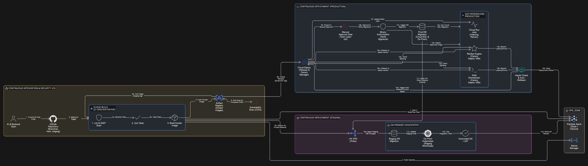

# CI/CD and DevSecOps

<figure><figcaption></figcaption></figure>

กระบวนการนำส่งซอฟต์แวร์ (Software Delivery) ของโครงการ MotherNest ถูกออกแบบภายใต้มาตรฐาน Enterprise DevSecOps เพื่อรับประกันความปลอดภัยสูงสุดของระบบ Health-Tech และความสามารถในการทำงานแบบ Hybrid Cloud ระหว่างระบบ On-Premise และ GCP โดยกระบวนการ Continuous Integration (CI) จะถูกควบคุมผ่าน Cloud Build และกระบวนการ Continuous Deployment (CD) จะบริหารจัดการผ่าน Cloud Deploy แบ่งออกเป็น 3 ระยะหลัก:

1\. Continuous Integration & Security Pipeline (กระบวนการผสานโค้ดและตรวจสอบความปลอดภัย)

* เมื่อวิศวกรทำการ Push โค้ดไปยัง GitHub จะเกิด Webhook ไปกระตุ้นการทำงานของ Cloud Build โดยอัตโนมัติ
* ระบบจะดึงข้อมูลที่ละเอียดอ่อน (เช่น API Keys) จาก Secret Manager อย่างปลอดภัย และเริ่มทำ SAST (Static Application Security Testing) รวมถึงการทำ Linting และ Unit Tests เพื่อตรวจจับข้อผิดพลาดของโค้ดและตรรกะการทำงานตั้งแต่เนิ่นๆ (Shift-Left Security)
* เมื่อผ่านการทดสอบ โค้ดจะถูกสร้างเป็น Docker Image และจัดเก็บที่ Artifact Registry ซึ่งมีระบบสแกนหาช่องโหว่ระดับคอนเทนเนอร์ (CVEs Vulnerability Scanner) ทำงานเป็นด่านสุดท้าย หากมีขั้นตอนใดล้มเหลวระบบจะส่งแจ้งเตือนกลับไปยังทีมพัฒนาทันที

2\. Staging Deployment (การนำขึ้นระบบทดสอบบน On-Premise)

* หากการอัปเดตเกิดขึ้นใน `staging` branch ระบบจะวิ่งผ่าน HA VPN Tunnel (IPsec) เข้าสู่ Datacenter ขององค์กร
* สคริปต์ DB Schema Migration จะทำงานเพื่อปรับปรุงโครงสร้างฐานข้อมูลจำลอง ก่อนที่ระบบจะนำ Image ไปรันบน Kubernetes Cluster (On-Premise)
* หลังจาก Deploy สำเร็จ ระบบจะรันชุดทดสอบ Automated QA / UAT แบบ End-to-End เพื่อยืนยันความถูกต้อง และส่งผลการทดสอบแจ้งเตือนไปยังทีมพัฒนาผ่าน Pub/Sub (Slack/Discord)

3\. Production Deployment & Canary Release (การนำขึ้นระบบจริงบน GCP แบบ Hybrid)

* เมื่อได้รับการยืนยันโค้ดลง `main` branch เครื่องมือ Cloud Deploy จะเข้ามาทำหน้าที่บริหารจัดการ Release โดยระบบจะหยุดรอที่ Manual Approval Gate เพื่อให้ Tech Lead หรือทีม QA ตรวจสอบและกดอนุมัติ
* หลังจากการอนุมัติ ระบบจะผ่านด่าน Binary Authorization เพื่อตรวจสอบลายเซ็นความปลอดภัยของ Image จากนั้นจะดำเนินการ Prod DB Migration ซึ่งครอบคลุมทั้งการอัปเดตฐานข้อมูล Cloud SQL และวิ่งผ่าน VPN ไปอัปเดตฐานข้อมูล On-Premise ให้สอดคล้องกัน
* Traffic Splitting & Canary Deploy: ระบบนำ Image ไปติดตั้งลงบน Serverless Services (RAG Orchestrator, RecSys Engine, และ Cloud Run Jobs) โดยใช้กลยุทธ์ Canary Release แบ่งทราฟฟิกเพียง 10% ไปยังเวอร์ชันใหม่
* Automated Rollback: Cloud Monitoring จะทำหน้าที่ตรวจจับ Error Rate และ Latency ของเวอร์ชันใหม่ หากพบความผิดปกติ จะส่งสัญญาณให้ Cloud Deploy ทำการย้ายทราฟฟิก 100% กลับไปยังเวอร์ชันเก่าโดยอัตโนมัติ (Rollback) เพื่อป้องกันไม่ให้ระบบล่มหรือ AI ตอบคำถามผิดพลาดเป็นวงกว้าง

***

#### 💡Architectural Justifications

ในการออกแบบระบบ CI/CD สำหรับโครงการ MotherNest ซึ่งเป็นแอปพลิเคชันที่จัดการกับข้อมูลสุขภาพ (Health-Tech) โครงการได้ตัดสินใจเชิงวิศวกรรมเพื่อรักษาสมดุลระหว่าง "ความรวดเร็วในการส่งมอบซอฟต์แวร์ (Agility)" และ "ความปลอดภัยสูงสุด (Maximum Security)" ดังนี้:

1\. กลยุทธ์ความปลอดภัยแบบเลื่อนซ้ายและหลักการความเชื่อใจเป็นศูนย์ (Shift-Left Security & Zero Trust)

* เหตุผล: ในระบบที่จัดการกับข้อมูลส่วนบุคคล (PDPA) ความปลอดภัยไม่สามารถรอไปตรวจในขั้นตอนสุดท้ายได้ และต้องป้องกันการนำ Image ที่ไม่ได้รับอนุญาตมารันบนระบบ
* ผลลัพธ์: โครงการผนวกการสแกนโค้ด (SAST), การทดสอบ (Unit Tests), และการสแกนช่องโหว่ (Vulnerability Scanning) เข้าไปใน CI Pipeline โดยตรง นอกจากนี้ยังใช้ Binary Authorization เป็นด่านก่อนขึ้น Production เพื่อรับประกันว่าเฉพาะโค้ดที่ผ่านการทดสอบและอนุมัติแล้วเท่านั้นที่จะถูกนำไปใช้งาน ป้องกันการแอบเปลี่ยนโค้ดกลางทางอย่างเด็ดขาด

2\. การจัดการ Release และการจำกัดรัศมีความเสียหาย (Release Management & Blast Radius Reduction)

* เหตุผล: ระบบ AI มีความเสี่ยงที่จะเกิดตรรกะผิดพลาด (Hallucination) การเปลี่ยนทราฟฟิก 100% ทันที (Big Bang Deployment) ถือว่ามีความเสี่ยงสูงเกินไปสำหรับแอปพลิเคชันสุขภาพ
* ผลลัพธ์: การใช้เครื่องมือระดับองค์กรอย่าง Cloud Deploy ทำ Canary Release (10%) ร่วมกับ Manual Approval Gate ช่วยเพิ่มความรอบคอบในการปล่อยฟีเจอร์ใหม่ และหากเกิดข้อผิดพลาด Cloud Deploy จะทำงานร่วมกับ Cloud Monitoring เพื่อดึงเวอร์ชันเก่ากลับมาให้บริการต่อได้ทันที (Zero-Downtime) ทำให้มีผู้ใช้เพียง 10% ที่เจอปัญหา

3\. การบริหารจัดการสภาพแวดล้อมและข้อมูลแบบผสมผสาน (Hybrid Environment & DB Consistency)

* เหตุผล: โครงการต้องการทดสอบระบบในสภาพแวดล้อมที่ใกล้เคียงความจริงที่สุดโดยไม่ปะปนกับฐานข้อมูลหลัก และต้องมั่นใจว่าเมื่อขึ้นระบบจริง โครงสร้างฐานข้อมูลทั้งสองฝั่งจะสอดคล้องกัน
* ผลลัพธ์: การออกแบบให้ Staging รันบน On-Premise Kubernetes ช่วยให้ทดสอบโมเดล AI ได้อย่างเต็มที่โดยไม่มีค่าใช้จ่ายคลาวด์เพิ่มเติม และในฝั่ง Production ระบบ Pipeline มีกลไก Hybrid DB Migration ที่สามารถสั่งอัปเดตโครงสร้างข้อมูลผ่าน VPN กลับไปยัง Datacenter หลักได้ เป็นการบูรณาการ Hybrid Cloud ที่ทำงานประสานกันอย่างไร้รอยต่อ

4\. การจัดการความลับแบบรวมศูนย์ (Centralized Secret Management)

* เหตุผล: การเก็บ API Keys (เช่น เครดิต Vertex AI) หรือรหัสผ่านฐานข้อมูลไว้ในซอร์สโค้ด (Hardcoding) หรือ Environment Variables แบบปกติ เป็นช่องโหว่ความปลอดภัยที่ร้ายแรง
* ผลลัพธ์: โครงการบังคับให้ Cloud Build ดึงข้อมูลที่ละเอียดอ่อนจาก Google Secret Manager เท่านั้น ทำให้ทีมพัฒนาสามารถหมุนเวียนรหัสผ่าน (Key Rotation) ได้ตลอดเวลาโดยไม่ต้องแก้โค้ด และไม่มีใครสามารถเข้าถึงรหัสผ่านฐานข้อมูล Production ได้โดยตรง
