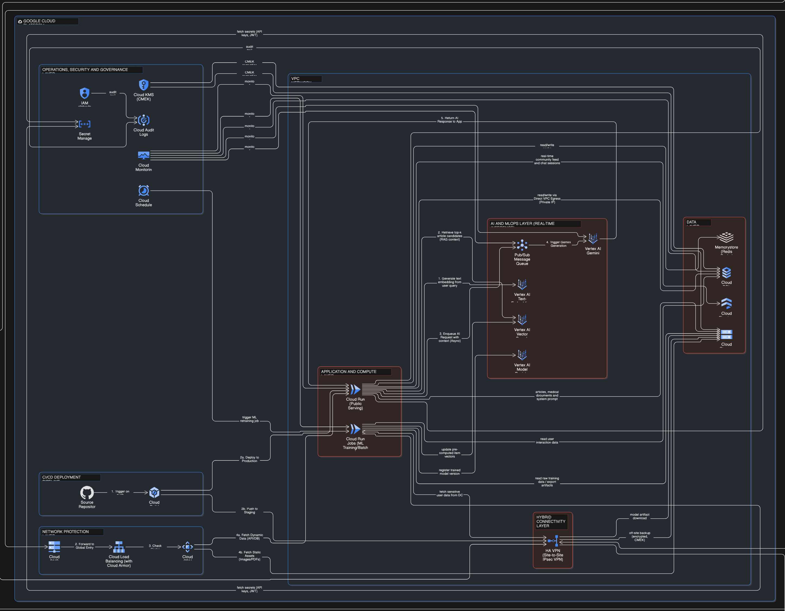

# Cloud Deployments

## Cloud provider and Services

#### Simplified

<figure><figcaption></figcaption></figure>

#### Full

<figure><figcaption></figcaption></figure>

### Provider: Google Cloud Platform

#### **1. Network Protection Layer**

| Service                      | Detail                                                            | Version or Spec                 | Estimated Monthly Cost (USD) |
| ---------------------------- | ----------------------------------------------------------------- | ------------------------------- | ---------------------------- |
| Cloud DNS                    | จัดการ Domain Name ของแอป                                         | Standard Zone                   | $1.00                        |
| Cloud Load Balancing & Armor | กระจายทราฟฟิกและป้องกันโจมตี (DDoS)                               | Global HTTP(S) LB + Basic Armor | $20.00                       |
| Cloud CDN                    | ทำหน้าที่เก็บสำเนาไฟล์ ไว้บน Server ที่กระจายอยู่ใกล้ตัวผู้ใช้งาน | Standard/Premium Tier           | \~$7.00                      |

#### 2. CI/CD Deployment Pipeline

| Service     | Detail                                               | Version or Spec                                         | Estimated Monthly Cost (USD) |
| ----------- | ---------------------------------------------------- | ------------------------------------------------------- | ---------------------------- |
| Cloud Build | Build, Test และ Deploy ซอฟต์แวร์แบบอัตโนมัติ (CI/CD) | Serverless CI/CD Platform (Managed Service) รุ่นปี 2026 | \~$0.10                      |

#### **3. Application and Compute Layer**

| Service          | Detail                                    | Version or Spec                            | Estimated Monthly Cost (USD) |
| ---------------- | ----------------------------------------- | ------------------------------------------ | ---------------------------- |
| Cloud Run & Jobs | รัน API Backend, RAG Pipeline และ ML Jobs | Serverless, 1 vCPU, 512MB RAM (Auto-scale) | \~$10.00                     |

#### **4. Hybrid Connectivity Layer**

| Service        | Detail                                 | Version or Spec                | Estimated Monthly Cost (USD) |
| -------------- | -------------------------------------- | ------------------------------ | ---------------------------- |
| HA VPN (IPsec) | เชื่อมต่อ On-premise Secure Datacenter | 2 Tunnels (เพื่อความเสถียร HA) | \~$72.00                     |

#### 5. Data Layer

<table><thead><tr><th>Service</th><th>Detail</th><th width="184">Version or Spec</th><th>Estimated Monthly Cost (USD)</th></tr></thead><tbody><tr><td>Cloud Storage</td><td>เก็บไฟล์ภาพ, บทความ, เอกสารทางการแพทย์</td><td>Standard Tier (พื้นที่ประมาณ 50 GB)</td><td>~$1.00</td></tr><tr><td>Cloud SQL (PostgreSQL)</td><td>เก็บข้อมูลหลัก และทำ Vector Store (pgvector)</td><td>db-g1-small (1 vCPU, 1.7GB RAM) + 50GB</td><td>~$35.00</td></tr><tr><td>Cloud Firestore</td><td>เก็บ Feature Store, Feedback และ Logs</td><td>Standard (โควต้าอ่านเขียน 50k ครั้ง/วัน)</td><td>~$5.00</td></tr><tr><td>Memorystore (Redis)</td><td>ระบบ Cache ลดภาระ Database ให้แอปโหลดไว</td><td>Basic Tier (1 GB capacity)</td><td>~$35.00</td></tr><tr><td>BigQuery</td><td>จัดเก็บ Feature Store, Click Logs และชุดข้อมูลฝึกสอน AI (MLOps)</td><td>On-demand (ฟรี 10 GB Storage / 1 TB Query แรกต่อเดือน)</td><td>~$0.00 - $2.00</td></tr></tbody></table>

#### 6. AI and MLOps Layer

| Service                   | Detail                                        | Version or Spec                                  | Estimated Monthly Cost (USD) |
| ------------------------- | --------------------------------------------- | ------------------------------------------------ | ---------------------------- |
| Vertex AI Gemini          | LLM ประมวลผล Chatbot ให้คำปรึกษาคุณแม่        | Gemini 1.5 Flash (ประเมิน 1000 DAU)              | \~$20.00                     |
| Vertex AI Vector Search   | ค้นหาและแนะนำบทความ (Feed Recommendation)     | Standard Node (เป็น Fixed Cost ขั้นต่ำของระบบ)   | \~$150.00\*                  |
| Pub/Sub                   | Message Queue จัดการ Task หลังบ้าน            | Standard (ใช้งานไม่เกิน 10 GB/month)             | $0.00 (Free Tier)            |
| Vertex AI Model Registry  | จัดเก็บและจัดการเวอร์ชันของโมเดล ML           | Standard (คิดค่าพื้นที่จัดเก็บแบบ Cloud Storage) | $0.00 (โควต้าฟรีครอบคลุม)    |
| Vertex AI Text-Embeddings | แปลง Text ให้กลายเป็น Vectors หรือ Embeddings | Standard                                         | \~$0.825                     |

#### 7. Operations, Security and Governance Layer

| Service                       | Detail                                            | Version or Spec                         | Estimated Monthly Cost (USD)    |
| ----------------------------- | ------------------------------------------------- | --------------------------------------- | ------------------------------- |
| Secret Manager & KMS          | เก็บ API Keys และรหัสผ่านฐานข้อมูล                | Standard                                | \~$1.00                         |
| Cloud Monitoring & Audit Logs | ตรวจสอบระบบแจ้งเตือนเมื่อล่ม                      | Standard (ใช้งานโควต้าฟรี)              | $0.00 (Free Tier)               |
| Cloud Scheduler               | ทริกเกอร์งานอัปเดตข้อมูลแบบตั้งเวลา (Cron)        | Standard (<10 jobs)                     | \~$1.00                         |
| IAM (RBAC)                    | จัดการสิทธิ์และการเข้าถึงทรัพยากร                 | Standard Feature                        | $0.00 (ไม่มีค่าบริการเพิ่มเติม) |
| Cloud KMS (CMEK)              | จัดการคีย์สำหรับเข้ารหัสข้อมูล (Encryption Keys)  | Standard (เก็บไม่กี่ Key และใช้งานน้อย) | \~$1.00                         |
| Cloud Audit Logs              | เก็บบันทึกประวัติการเข้าถึงและการทำงาน (Security) | Standard (ฟรี 50GB แรก/เดือน)           | $0.00 (Free Tier)               |

