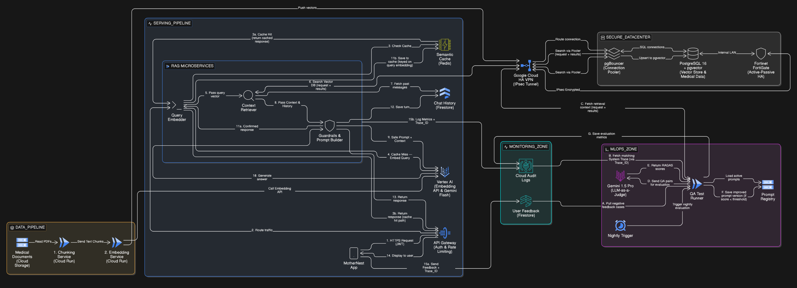

# Cloud Deployments

## Cloud provider and Services

#### Simplified

<figure><figcaption></figcaption></figure>

#### Full

<figure><figcaption></figcaption></figure>

### Provider: Google Cloud Platform

#### **1. Network Protection Layer**

| Service                      | Detail                                                            | Version or Spec                 | Estimated Monthly Cost (USD) |
| ---------------------------- | ----------------------------------------------------------------- | ------------------------------- | ---------------------------- |
| Cloud DNS                    | จัดการ Domain Name ของแอป                                         | Standard Zone                   | $1.00                        |
| Cloud Load Balancing & Armor | กระจายทราฟฟิกและป้องกันโจมตี (DDoS)                               | Global HTTP(S) LB + Basic Armor | $20.00                       |
| Cloud CDN                    | ทำหน้าที่เก็บสำเนาไฟล์ ไว้บน Server ที่กระจายอยู่ใกล้ตัวผู้ใช้งาน | Standard/Premium Tier           | \~$7.00                      |

#### 2. CI/CD Deployment Pipeline

| Service     | Detail                                               | Version or Spec                                         | Estimated Monthly Cost (USD) |
| ----------- | ---------------------------------------------------- | ------------------------------------------------------- | ---------------------------- |
| Cloud Build | Build, Test และ Deploy ซอฟต์แวร์แบบอัตโนมัติ (CI/CD) | Serverless CI/CD Platform (Managed Service) รุ่นปี 2026 | \~$0.10                      |

#### **3. Application and Compute Layer**

| Service          | Detail                                    | Version or Spec                            | Estimated Monthly Cost (USD) |
| ---------------- | ----------------------------------------- | ------------------------------------------ | ---------------------------- |
| Cloud Run & Jobs | รัน API Backend, RAG Pipeline และ ML Jobs | Serverless, 1 vCPU, 512MB RAM (Auto-scale) | \~$10.00                     |

#### **4. Hybrid Connectivity Layer**

| Service        | Detail                                 | Version or Spec                | Estimated Monthly Cost (USD) |
| -------------- | -------------------------------------- | ------------------------------ | ---------------------------- |
| HA VPN (IPsec) | เชื่อมต่อ On-premise Secure Datacenter | 2 Tunnels (เพื่อความเสถียร HA) | \~$72.00                     |

#### 5. Data Layer

| Service                | Detail                                       | Version or Spec                          | Estimated Monthly Cost (USD) |
| ---------------------- | -------------------------------------------- | ---------------------------------------- | ---------------------------- |
| Cloud Storage          | เก็บไฟล์ภาพ, บทความ, เอกสารทางการแพทย์       | Standard Tier (พื้นที่ประมาณ 50 GB)      | \~$1.00                      |
| Cloud SQL (PostgreSQL) | เก็บข้อมูลหลัก และทำ Vector Store (pgvector) | db-g1-small (1 vCPU, 1.7GB RAM) + 50GB   | \~$35.00                     |
| Cloud Firestore        | เก็บ Feature Store, Feedback และ Logs        | Standard (โควต้าอ่านเขียน 50k ครั้ง/วัน) | \~$5.00                      |
| Memorystore (Redis)    | ระบบ Cache ลดภาระ Database ให้แอปโหลดไว      | Basic Tier (1 GB capacity)               | \~$35.00                     |

#### 6. AI and MLOps Layer

| Service                   | Detail                                        | Version or Spec                                  | Estimated Monthly Cost (USD) |
| ------------------------- | --------------------------------------------- | ------------------------------------------------ | ---------------------------- |
| Vertex AI Gemini          | LLM ประมวลผล Chatbot ให้คำปรึกษาคุณแม่        | Gemini 1.5 Flash (ประเมิน 1000 DAU)              | \~$20.00                     |
| Vertex AI Vector Search   | ค้นหาและแนะนำบทความ (Feed Recommendation)     | Standard Node (เป็น Fixed Cost ขั้นต่ำของระบบ)   | \~$150.00\*                  |
| Pub/Sub                   | Message Queue จัดการ Task หลังบ้าน            | Standard (ใช้งานไม่เกิน 10 GB/month)             | $0.00 (Free Tier)            |
| Vertex AI Model Registry  | จัดเก็บและจัดการเวอร์ชันของโมเดล ML           | Standard (คิดค่าพื้นที่จัดเก็บแบบ Cloud Storage) | $0.00 (โควต้าฟรีครอบคลุม)    |
| Vertex AI Text-Embeddings | แปลง Text ให้กลายเป็น Vectors หรือ Embeddings | Standard                                         | \~$0.825                     |

#### 7. Operations, Security and Governance Layer

| Service                       | Detail                                            | Version or Spec                         | Estimated Monthly Cost (USD)    |
| ----------------------------- | ------------------------------------------------- | --------------------------------------- | ------------------------------- |
| Secret Manager & KMS          | เก็บ API Keys และรหัสผ่านฐานข้อมูล                | Standard                                | \~$1.00                         |
| Cloud Monitoring & Audit Logs | ตรวจสอบระบบแจ้งเตือนเมื่อล่ม                      | Standard (ใช้งานโควต้าฟรี)              | $0.00 (Free Tier)               |
| Cloud Scheduler               | ทริกเกอร์งานอัปเดตข้อมูลแบบตั้งเวลา (Cron)        | Standard (<10 jobs)                     | \~$1.00                         |
| IAM (RBAC)                    | จัดการสิทธิ์และการเข้าถึงทรัพยากร                 | Standard Feature                        | $0.00 (ไม่มีค่าบริการเพิ่มเติม) |
| Cloud KMS (CMEK)              | จัดการคีย์สำหรับเข้ารหัสข้อมูล (Encryption Keys)  | Standard (เก็บไม่กี่ Key และใช้งานน้อย) | \~$1.00                         |
| Cloud Audit Logs              | เก็บบันทึกประวัติการเข้าถึงและการทำงาน (Security) | Standard (ฟรี 50GB แรก/เดือน)           | $0.00 (Free Tier)               |

## MLOps Architecture Diagram

### 1. AI Recommendation Feed

<figure><figcaption></figcaption></figure>

ระบบ AI สำหรับแนะนำบทความนี้ ถูกออกแบบมาเพื่อคัดเลือกบทความที่ตรงกับความสนใจและอายุครรภ์ของคุณแม่แต่ละท่านมากที่สุด โดยทำงานอัตโนมัติผ่าน 4 ขั้นตอนหลัก ดังนี้:

#### 1. Data Pipeline (กระบวนการเตรียมข้อมูล)

จุดเริ่มต้นของการรวบรวมและทำความสะอาดข้อมูล เพื่อเตรียมพร้อมสำหรับการสอนโมเดล

* แหล่งที่มาข้อมูล:
  * Cloud Storage: จัดเก็บข้อมูลทั่วไป เช่น เนื้อหาบทความ , หมวดหมู่ และอายุครรภ์ที่เหมาะสมของบทความ
  * Secure Data Center (On-premise): จัดเก็บข้อมูลสุขภาพที่ละเอียดอ่อน เช่น อายุครรภ์จริง และประวัติการอ่าน ข้อมูลส่วนนี้จะถูกส่งผ่านช่องทางที่ปลอดภัย (Fortinet FortiGate และ HA VPN IPSec Tunnel) เท่านั้น
* Preprocessing: ข้อมูลทั้งหมดจะถูกส่งมาพักไว้ที่ Cloud Firestore ก่อนที่ Cloud Run Jobs จะเริ่มทำงาน
  * Data Cleaning: ทำความสะอาดและจัดรูปแบบข้อมูลดิบ
  * Feature Engineering: แปลงข้อมูลให้อยู่ในรูปแบบที่โมเดลใช้งานได้ (Features) และนำไปจัดเก็บไว้ที่ Cloud Firestore (Feature Store) เพื่อรอการนำไปใช้งาน

#### 2. ML Pipeline (กระบวนการเทรนโมเดล)

นำ Features ที่เตรียมไว้มาสอนให้ AI เรียนรู้พฤติกรรมและความสนใจของผู้ใช้งานผ่าน Cloud Run Jobs (Training)

* Item Representation:
  * SBERT Embedding Job: แปลงเนื้อหาบทความ หมวดหมู่ และ อายุครรภ์ที่เหมาะสมของบทความ ให้เป็นชุดตัวเลข (Embedding Vector)
  * MLP Item Tower: รับค่าที่ได้มาบีบอัดขนาดลงจนได้เป็น `item_vector` ซึ่งเป็นตัวแทนความหมายของบทความแต่ละชิ้น
* User Representation: MLP User Tower: นำ อายุครรภ์จริง และประวัติการอ่านมาแปลงเป็น `user_vector` ของผู้ใช้แต่ละคน
* BCE Joint Training: นำ `item_vector` และ `user_vector` มาจับคู่กันเพื่อคำนวณคะแนน (Dot Product) แล้วเทียบกับประวัติการคลิกจริงด้วย BCE Loss เพื่อสอนให้โมเดลรู้ว่า บทความแบบไหนที่ผู้ใช้คนนี้มีแนวโน้มจะสนใจ
* Model Registration: ตัวชี้วัดความแม่นยำ (เช่น Loss, AUC-ROC) จะถูกบันทึกเพื่อวัดผล และตัวโมเดลจะถูกจัดเก็บเวอร์ชันไว้ที่ Vertex AI Model Registry (รองรับการ Rollback หากจำเป็น)
  * `item_vectors` ทั้งหมดของระบบจะถูกทำดัชนีส่งเข้าไปเก็บที่ Vertex AI Vector Search เพื่อเตรียมพร้อมสำหรับการค้นหา

#### 3. Deployment Pipeline (กระบวนการใช้งานจริง)

เมื่อผู้ใช้งานเปิดแอปพลิเคชัน ระบบจะทำการประมวลผลเพื่อดึงบทความมาแสดงผลแบบ Real-time ที่ Cloud Run Backend (Serving)

* User Vector Inference: เมื่อแอปส่ง Request เข้ามาพร้อม `user_id` ระบบจะดึงข้อมูล อายุครรภ์จริง และประวัติการอ่านจาก Data Center มาเข้าโมเดล User Tower เพื่อคำนวณ `user_vector` ล่าสุด ณ ขณะนั้น
* Candidate Retrieval: ส่ง `user_vector` ไปที่ Vertex AI Vector Search เพื่อค้นหาบทความ (ANN Query) ที่มีความใกล้เคียงกับความสนใจที่สุด (Candidate Articles)
* Score and Rank: นำ Candidate ที่ได้มาคำนวณคะแนน Preference Score (จาก `user_vector` x `item_vector`) รวมกับ Time Relevance Score (ความเหมาะสมกับอายุครรภ์ปัจจุบัน) แล้วจัดเรียงลำดับบทความจากคะแนนมากไปน้อย
* Filter Module: คัดกรองบทความที่ผู้ใช้งาน "เคยอ่านไปแล้ว" ออกจากรายการ เพื่อส่งมอบ JSON ผลลัพธ์บทความใหม่ๆ กลับไปที่ Mobile App

#### 4. Monitoring & Feedback Loop (กระบวนการตรวจสอบและเรียนรู้อัตโนมัติ)

ระบบถูกออกแบบให้สามารถเรียนรู้และเก่งขึ้นได้เอง โดยไม่ต้องใช้คนเข้าไปสั่ง Retrain

* Feedback Collection: ทุกครั้งที่ผู้ใช้กดอ่านหรือเลื่อนผ่านบทความ แอปจะส่ง Click Event (`user_id`, `article_id`, สถานะการคลิก) ผ่าน Cloud Audit Logs ไปสะสมเป็น Labeled Data ชุดใหม่ที่ Cloud Firestore (Label Store)
* Drift Detection: ระบบ Cloud Monitoring จะคอยตรวจสอบความแม่นยำของโมเดล หากพบว่าพฤติกรรมผู้ใช้เปลี่ยนไปจนเกินเกณฑ์ที่กำหนด (Data Drift) ระบบจะส่งการแจ้งเตือน
* Auto-Retraining: เมื่อถึงรอบเวลาที่กำหนด หรือได้รับการแจ้งเตือน Drift Cloud Scheduler จะกระตุ้น (Trigger) ให้ระบบดึงข้อมูลพฤติกรรมชุดใหม่ล่าสุดเข้าสู่กระบวนการ ML Pipeline อีกครั้ง ทำให้ Recommendation Feed แม่นยำและอัปเดตอยู่เสมอ

## 2. Comprehensive Microservices RAG in Hybrid Cloud

สถาปัตยกรรมของแชทบอท MotherNest ถูกออกแบบด้วยแนวคิด Hybrid Cloud Microservices โดยผสานจุดแข็งของการประมวลผล AI บน Google Cloud Platform เข้ากับความปลอดภัยของข้อมูลสุขภาพที่จัดเก็บแบบ On-Premise (ตามมาตรฐาน PDPA) ระบบถูกแบ่งการทำงานออกเป็น 5 โซนย่อย เพื่อให้สามารถขยายขนาด (Scale) และดูแลรักษา (Maintain) ได้อย่างอิสระ

<figure><figcaption></figcaption></figure>

***

#### องค์ประกอบหลักของระบบ (System Components by Zone)

**ZONE 0: On-Premise Secure Datacenter (ศูนย์ข้อมูลความปลอดภัยสูง)**

ทำหน้าที่เป็นฐานข้อมูลหลักที่เก็บข้อมูลส่วนบุคคลและข้อมูลเวกเตอร์ (Medical Context) โดยไม่นำข้อมูลเหล่านี้ไปพักทิ้งไว้บน Public Cloud

* PostgreSQL 16 + pgvector: ฐานข้อมูลเชิงสัมพันธ์ที่รองรับการค้นหาความคล้ายคลึงของเวกเตอร์ (Vector Similarity Search)
* pgBouncer: ระบบ Connection Pooler ทำหน้าที่บริหารจัดการและต่อคิวการเชื่อมต่อฐานข้อมูลจาก Microservices ป้องกันภาวะ Database Overload
* Fortinet FortiGate (HA): Firewall ระดับ Enterprise ทำงานแบบ Active-Passive ปกป้องเครือข่ายภายใน
* Google Cloud HA VPN: อุโมงค์เข้ารหัส (IPsec Tunnel) สำหรับเชื่อมต่อเครือข่ายระหว่าง GCP และ On-Premise อย่างปลอดภัย

**ZONE 1: Data Pipeline (กระบวนการนำเข้าและดัชนีข้อมูล)**

* Medical Storage (GCS): แหล่งเก็บไฟล์เอกสารทางการแพทย์ต้นฉบับ (PDFs/Text)
* Chunking Service & Embedding Service: Cloud Run Microservices ที่รับหน้าที่ทำความสะอาดข้อความ ตัดแบ่งคำ (Chunking) และเรียกใช้ Vertex AI เพื่อแปลงเป็นเวกเตอร์ ก่อนจะส่งไปบันทึกลง Datacenter แบบทางเดียว (One-directional Push)

**ZONE 2: Deployment Pipeline (กระบวนการให้บริการตอบกลับแบบเรียลไทม์)**

* API Gateway: ด่านหน้าในการตรวจสอบสิทธิ์ผู้ใช้ (JWT Authentication) และควบคุมปริมาณการใช้งาน (Rate Limiting)
* Semantic Cache (Redis): ระบบแคชอัจฉริยะที่ช่วยดึงคำตอบเดิมกลับมาใช้งานทันทีหากเวกเตอร์ของคำถามมีความหมายเหมือนกับที่เคยถามไปแล้ว
* RAG Microservices: หัวใจหลักของการประมวลผล แบ่งเป็น 3 ส่วน: `Query_Embedder` (แปลงคำถามและจัดการแคช), `Context_Retriever` (ดึงข้อมูลบริบทจากฐานข้อมูล), และ `Guardrails_Prompt` (ตรวจสอบความปลอดภัยและสร้างคำตอบ)
* Chat History (Firestore): ฐานข้อมูล NoSQL สำหรับเก็บสถานะและบริบทการสนทนาต่อเนื่องของผู้ใช้

**ZONE 3 & 4: MLOps, Evaluation & Monitoring (กระบวนการเฝ้าระวังและพัฒนา AI อัตโนมัติ)**

* Feedback Store & Audit Logs: จัดเก็บผลโหวตความพึงพอใจจากผู้ใช้และ Log ประสิทธิภาพการทำงานของระบบ โดยผูกข้อมูลสองส่วนนี้เข้าด้วยกันผ่าน Trace\_ID
* QA Test Runner & LLM-Evaluator: ท่อประเมินผลอัตโนมัติที่ทำงานทุกคืน โดยใช้ Gemini 1.5 Pro (LLM-as-a-Judge) ตรวจสอบคำตอบที่ได้คะแนนต่ำ และอัปเดต Prompt ใหม่โดยอัตโนมัติ

***

#### การไหลของข้อมูลและกระบวนการทำงาน (Data Flow & Protocols)

**1. Asynchronous Indexing Flow (กระบวนการแปลงเอกสาร)**

เป็นกระบวนการทำงานเบื้องหลัง (Background Job) แบบทิศทางเดียว:

1. เอกสารแพทย์ชุดใหม่ถูกส่งเข้าระบบ `Chunking_Service` จะทำการหั่นข้อความเป็นส่วนย่อย
2. `Embedding_Service` เรียกใช้ Vertex AI เพื่อแปลงข้อความเป็นตัวเลขเวกเตอร์
3. ข้อมูลเวกเตอร์จะถูกส่งผ่าน HA VPN ไปยังฝั่ง On-Premise โดยมี `pgBouncer` รับช่วงต่อเพื่อเขียนข้อมูล (Upsert) ลงในฐานข้อมูล `pgvector` อย่างปลอดภัย

**2. Real-Time Chat Flow & Caching Strategy (กระบวนการสนทนาและแคชอัจฉริยะ)**

เพื่อให้การตอบกลับผู้ใช้ 1,000 DAU มี Latency ต่ำที่สุด ระบบถูกออกแบบให้มีการจัดการ Cache อย่างเป็นระบบ:

* Step 1-3 (Request & Cache Hit Path): ผู้ใช้ส่งคำถามผ่าน API Gateway ไปยัง `Query_Embedder` ระบบจะเช็คกับ `Semantic_Cache` ก่อน หากพบคำถามที่ความหมายตรงกัน (Cache Hit) จะดึงคำตอบเดิมส่งกลับให้ผู้ใช้ทันที (ประหยัดทั้งเวลาและค่า API)
* Step 4-8 (Cache Miss & Retrieval Path): หากไม่พบข้อมูล `Query_Embedder` จะแปลงคำถามเป็นเวกเตอร์แล้วส่งต่อให้ `Context_Retriever` เพื่อมุดผ่าน VPN ไปค้นหาบริบทแพทย์ (Medical Context) จากฝั่ง On-premise (เป็นการสื่อสารแบบ 2 ทิศทาง - Bidirectional) และดึงประวัติการแชทล่าสุดจาก Firestore
* Step 9-14 (Generation & State Persistence): `Guardrails_Prompt` ประกอบ Prompt ส่งให้ Gemini 1.5 Flash ตอบคำถาม เมื่อได้คำตอบที่ปลอดภัยแล้ว ข้อมูลจะถูกส่งกลับไปให้ `Query_Embedder` ทำการบันทึกคำตอบลง Cache (Cache Ownership) พร้อมกับบันทึกประวัติการแชทลง Firestore ก่อนส่งคำตอบแสดงผลบนหน้าจอผู้ใช้

**3. Traceability & Monitoring Flow (กระบวนการติดตามปัญหา)**

* เมื่อผู้ใช้งานกดให้คะแนน (Thumbs Up/Down) หรือแจ้งปัญหาผ่านแอป ข้อมูลจะถูกบันทึกลง `Feedback_Store` พร้อมแนบค่า Trace\_ID \* ในขณะเดียวกัน ข้อมูลเชิงลึกของระบบ (เช่น Latency, Prompt ที่ใช้, Context ที่ดึงมา) จะถูกบันทึกลง `Audit_Logs` ด้วย Trace\_ID เดียวกัน ทำให้ระบบสามารถเชื่อมโยงผลลัพธ์ในมุมมองผู้ใช้และมุมมองระบบเข้าด้วยกันได้ 100%

**4. Automated MLOps & Self-Improving Prompt (วงจรพัฒนาโมเดลอัจฉริยะ)**

เป็นกระบวนการยกระดับคุณภาพของ RAG Pipeline โดยอัตโนมัติ (Nightly Batch):

1. `Cloud_Scheduler` สั่งรัน `QA_Test_Job` ในช่วงกลางคืน
2. ระบบดึงเคสแชทที่ได้คะแนนติดลบจาก `Feedback_Store` และดึงข้อมูลเชิงลึกจาก `Audit_Logs` ผ่านการจับคู่ด้วย Trace\_ID
3. ระบบดึง Medical Context ของเคสนั้นๆ จาก On-Premise (ผ่าน VPN) มาอีกครั้ง เพื่อส่งให้ Gemini 1.5 Pro ทำหน้าที่เป็นกรรมการประเมิน (LLM-as-a-Judge) ตามมาตรฐาน RAGAS (Faithfulness & Answer Relevance)
4. Self-Correction Mechanism: หากคะแนนประเมินพบว่าโมเดลมีปัญหาจากตัวคำสั่ง (Prompt) ระบบจะทำการสร้างและอัปเดต Prompt template เวอร์ชันที่รัดกุมกว่าเดิมไปบันทึกทับใน `Prompt_Registry` เพื่อใช้ในการตอบคำถามวันถัดไปทันที พร้อมบันทึกผลการประเมินลง Audit Logs สำหรับจัดทำ Dashboard

***

#### 💡 Architectural Justifications

* ทำไม `Query_Embedder` ถึงเป็นตัวจัดการ Cache?: การออกแบบให้ Query Embedder เป็นผู้รับผิดชอบการเช็คและบันทึกข้อมูลลง Redis (แทนที่จะเป็น API Gateway) เป็นการทำตามหลักการ Separation of Concerns เนื่องจาก Query Embedder เป็นผู้ถือ "Vector Key" ที่แท้จริงในการเปรียบเทียบความหมายของประโยค
* การอัปเดต Prompt อัตโนมัติ (Closed-loop MLOps): สถาปัตยกรรมนี้ไม่ได้เพียงแค่เฝ้าระวัง (Monitor) แต่สามารถ ปรับปรุงตัวเองได้ (Self-improving) หากเกิด Hallucination การนำผลจาก LLM Judge มาเขียนทับ Prompt ใน Registry ช่วยลดภาระของวิศวกรในการมานั่งทำ Manual Prompt Engineering รายวัน
* การเชื่อมโยงข้อมูลด้วย Trace\_ID: การทำ Distributed Tracing ในระบบ Microservices ช่วยให้สามารถทำ Root Cause Analysis (RCA) ในระบบทางการแพทย์ได้อย่างแม่นยำ หากเกิดข้อพิพาทเรื่องคำตอบ ระบบสามารถตรวจสอบย้อนหลังได้ถึงระดับเอกสารที่ใช้อ้างอิง ณ วินาทีนั้น
