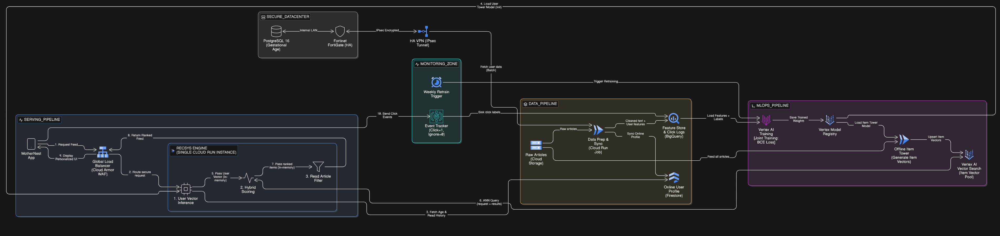
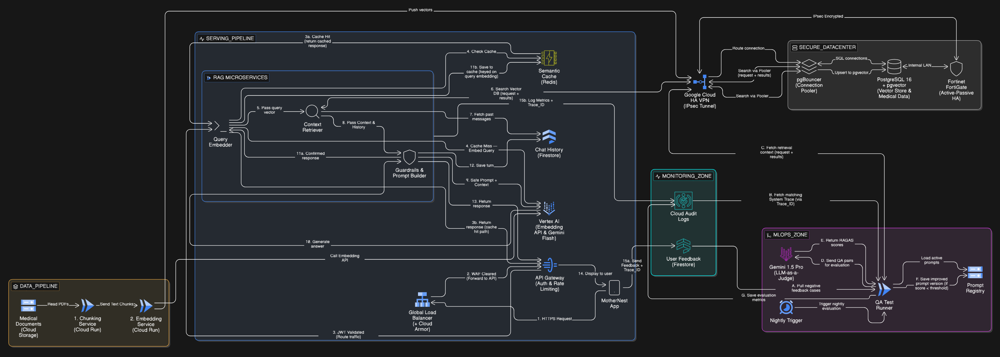

# MLOps Architecture

## 1. AI Recommendation System

<figure><figcaption></figcaption></figure>

### Two-Tower Model Pipeline in Hybrid Cloud

ระบบแนะนำบทความสำหรับคุณแม่ตั้งครรภ์ (Personalized Feed) ในแอปพลิเคชัน MotherNest ถูกออกแบบด้วยสถาปัตยกรรม Two-Tower Deep Learning ภายใต้สภาพแวดล้อมแบบ Hybrid Cloud เพื่อรักษาความปลอดภัยของข้อมูลส่วนบุคคลขั้นสูงสุด (Data Privacy) ในขณะที่ยังคงความสามารถในการสเกล (Scalability) และมีความหน่วงต่ำ (Low Latency) โครงสร้างสถาปัตยกรรมแบ่งออกเป็น 5 โซนหลัก ดังนี้:

#### 1. องค์ประกอบของสถาปัตยกรรม (System Components by Zone)

*   ZONE 0: On-Premise Secure Datacenter (ศูนย์ข้อมูลความปลอดภัยสูง)

    เป็นแหล่งเก็บข้อมูลหลัก (Source of Truth) โดยมี PostgreSQL 16 จัดเก็บข้อมูลอายุครรภ์ (Gestational Age) และข้อมูลส่วนบุคคล ซึ่งถูกปกป้องด้วย Fortinet FortiGate HA และเชื่อมต่อกับคลาวด์ผ่านอุโมงค์เข้ารหัส HA VPN (IPsec Tunnel)
*   ZONE 1: Data Pipeline & Feature Store (ส่งข้อมูลและคลังฟีเจอร์)

    ประกอบด้วย Cloud Storage สำหรับเก็บไฟล์บทความดิบ, Cloud Run Job สำหรับทำ Data Preparation, และ BigQuery ซึ่งทำหน้าที่เป็น Feature Store และ Label Store สำหรับเก็บสถิติการคลิก นอกจากนี้ยังมี Firestore (Profile Cache) ทำหน้าที่เป็นแคชความเร็วสูงสำหรับข้อมูลโปรไฟล์ออนไลน์
*   ZONE 2: MLOps & Offline Pipeline (ฝึกสอนโมเดลอัตโนมัติ)

    ใช้ Vertex AI Training ในการฝึกสอนโมเดลแบบคู่ขนาน (Joint Training) ตามสถาปัตยกรรม Two-Tower และจัดเก็บโมเดลที่ฝึกเสร็จแล้วใน Model Registry จากนั้นใช้ Cloud Run Job แปลงบทความทั้งหมดเป็นเวกเตอร์เพื่อเก็บใน Vertex AI Vector Search
*   ZONE 3: Online Serving Pipeline (กระบวนการให้บริการแบบเรียลไทม์)

    รับทราฟฟิกผ่าน Global Load Balancer (พร้อม Cloud Armor WAF) เพื่อความปลอดภัยระดับเครือข่าย และประมวลผลการจัดอันดับบทความผ่าน RecSys Engine (Cloud Run) ซึ่งออกแบบโครงสร้างภายในเป็น Modular Monolith
*   ZONE 4: Monitoring & Feedback (ระบบติดตามและผลตอบรับ)

    ใช้ Event Tracker (Cloud Audit Logs) บันทึกพฤติกรรมการใช้งาน (คลิก = 1, เลื่อนผ่าน = 0) และมี Cloud Scheduler เป็นตัวจุดชนวนกระบวนการฝึกสอนซ้ำ (Retraining) ทุกสัปดาห์

***

#### 2. การไหลของข้อมูลและกระบวนการทำงาน (Data Flow & Operational Steps)

กระบวนการทำงานของระบบถูกแบ่งออกเป็น 4 เฟสหลัก เพื่อแยกภาระงาน (Decoupling) ระหว่างส่วนที่ต้องการความเร็วแบบเรียลไทม์ และส่วนที่ประมวลผลแบบเบื้องหลัง:

Phase 1: การเตรียมข้อมูลและการซิงโครไนซ์ (Data Prep & Sync)

ระบบทำงานแบบ Batch Processing โดยดึงข้อมูลอายุครรภ์และประวัติการอ่านจาก On-Premise ผ่าน VPN มาพักไว้ที่ Firestore (Profile Cache) เพื่อให้ระบบออนไลน์สืบค้นได้รวดเร็วโดยไม่ต้องรอ Network Latency จาก VPN และส่งข้อมูลบทความที่ทำความสะอาดแล้วไปเก็บไว้ที่ BigQuery Feature Store

Phase 2: การฝึกสอนโมเดลและการสร้างเวกเตอร์ (MLOps & Vector Generation)

* Joint Training: ทุกสัปดาห์ Cloud Scheduler จะสั่งให้ Vertex AI ดึงข้อมูลจาก BigQuery มาสอนโมเดล โดยฝึกสอน User Tower (วิเคราะห์อายุครรภ์และประวัติการอ่าน) และ Item Tower (วิเคราะห์เนื้อหาด้วย SBERT และหมวดหมู่บทความ) ไปพร้อมๆ กัน โดยปรับน้ำหนักโมเดลผ่านฟังก์ชัน BCE Loss (Binary Cross-Entropy) เทียบกับพฤติกรรมการคลิกจริงของผู้ใช้
* Vector Pool Update: โมเดล Item Tower ที่สมบูรณ์จะถูกโหลดไปสร้าง Item Vector สำหรับบทความทั้งหมด และบันทึกลง Vertex AI Vector Search เพื่อรอการถูกสืบค้น

Phase 3: การให้บริการจัดอันดับบทความแบบเรียลไทม์ (Real-Time Serving) เมื่อผู้ใช้งานร้องขอหน้า Feed ข้อมูลจะวิ่งผ่าน Global Load Balancer เข้าสู่ RecSys Engine ซึ่งจะทำงาน 3 ขั้นตอนต่อเนื่องในระดับหน่วยความจำ (In-memory Flow):

1. User Vector Inference: ดึงข้อมูลจาก Profile Cache มาเข้าโมเดล User Tower เพื่อแปลงความสนใจของผู้ใช้ออกมาเป็นเวกเตอร์
2. Hybrid Scoring: นำ User Vector ไปยิงคำสั่งค้นหา (ANN Query) ใน Vector Search เพื่อหาบทความที่มีค่า Semantic Score สูงสุด นำมาเข้าสมการคณิตศาสตร์ (Weighted Sum) รวมกับ Stage Score (ความสอดคล้องกับอายุครรภ์ ณ ปัจจุบัน) เพื่อให้ได้คะแนนความเหมาะสมขั้นสุดท้าย
3. Read Article Filter: กรองบทความที่ผู้ใช้เคยอ่านไปแล้วออก ก่อนส่งผลลัพธ์ (Ranked Feed) กลับไปแสดงผลบนแอปพลิเคชัน

Phase 4: วงจรเรียนรู้อย่างต่อเนื่อง (The Feedback Loop)

ทุกเหตุการณ์การคลิก (Click Events) จะถูกบันทึกผ่าน Event Tracker และส่งไปเก็บสะสมใน BigQuery เพื่อทำหน้าที่เป็น Ground Truth (Labels) สำหรับรอบการฝึกสอนโมเดลในสัปดาห์ถัดไป ทำให้ AI ฉลาดขึ้นและเข้าใจเทรนด์ความสนใจของคุณแม่ที่เปลี่ยนไปตามกาลเวลา

#### 💡Architectural Justifications

เพื่อให้ระบบเหมาะสมกับผู้ใช้งาน 1,000 DAU โครงการได้ตัดสินใจออกแบบทางวิศวกรรมดังนี้:

1. การรวมศูนย์ด้วย Global Load Balancer: ระบบเลือกใช้ Global Load Balancer เป็นประตูด่านหน้า (Front Door) แทน API Gateway ธรรมดา เพื่อบูรณาการระบบความปลอดภัย Cloud Armor (WAF) ปกป้องทั้ง API ทั่วไปและ AI Microservices ไว้ภายใต้มาตรฐานเดียวกัน สอดคล้องกับ Main Architecture ขององค์กร
2. การออกแบบ RecSys แบบ Modular Monolith: ภายใน RecSys Engine ถูกแบ่งโมดูลลอจิกชัดเจน (Inference, Scoring, Filtering) แต่รันอยู่ใน Cloud Run Instance เดียวกัน การออกแบบนี้ช่วยให้การส่งต่อข้อมูลเวกเตอร์ระหว่างขั้นตอนเป็นไปในลักษณะ In-Memory Execution ขจัดปัญหา HTTP Network Overhead ที่มักพบใน Distributed Microservices ทำให้สามารถส่งมอบหน้า Feed ให้ผู้ใช้งานได้ในหลักมิลลิวินาที (Milliseconds)
3. BigQuery ในฐานะ ML Feature Store: การใช้ BigQuery เป็นศูนย์กลางรวบรวมข้อมูลทั้งฝั่ง Features (คุณลักษณะบทความและผู้ใช้) และ Labels (ประวัติการคลิก) ช่วยให้การทำ Time-travel Data สำหรับป้อนเข้า Vertex AI Training เป็นไปอย่างมีประสิทธิภาพและถูกต้องตามหลัก MLOps ระดับ Enterprise

***

## 2. AI Chatbot

Comprehensive Microservices RAG in Hybrid Cloud

สถาปัตยกรรมของแชทบอท MotherNest ถูกออกแบบด้วยแนวคิด Hybrid Cloud Microservices โดยผสานจุดแข็งของการประมวลผล AI บน Google Cloud Platform เข้ากับความปลอดภัยของข้อมูลสุขภาพที่จัดเก็บแบบ On-Premise (ตามมาตรฐาน PDPA) ระบบถูกแบ่งการทำงานออกเป็น 5 โซนย่อย เพื่อให้สามารถขยายขนาด (Scale) และดูแลรักษา (Maintain) ได้อย่างอิสระ

<figure><figcaption></figcaption></figure>

#### องค์ประกอบหลักของระบบ (System Components by Zone)

**ZONE 0: On-Premise Secure Datacenter (ศูนย์ข้อมูลความปลอดภัยสูง)**

ทำหน้าที่เป็นฐานข้อมูลหลักที่เก็บข้อมูลส่วนบุคคลและข้อมูลเวกเตอร์ (Medical Context) โดยไม่นำข้อมูลเหล่านี้ไปพักทิ้งไว้บน Public Cloud

* PostgreSQL 16 + pgvector: ฐานข้อมูลเชิงสัมพันธ์ที่รองรับการค้นหาความคล้ายคลึงของเวกเตอร์ (Vector Similarity Search)
* pgBouncer: ระบบ Connection Pooler ทำหน้าที่บริหารจัดการและต่อคิวการเชื่อมต่อฐานข้อมูลจาก Microservices ป้องกันภาวะ Database Overload
* Fortinet FortiGate (HA): Firewall ระดับ Enterprise ทำงานแบบ Active-Passive ปกป้องเครือข่ายภายใน
* Google Cloud HA VPN: อุโมงค์เข้ารหัส (IPsec Tunnel) สำหรับเชื่อมต่อเครือข่ายระหว่าง GCP และ On-Premise อย่างปลอดภัย

**ZONE 1: Data Pipeline (กระบวนการนำเข้าและดัชนีข้อมูล)**

* Medical Storage (GCS): แหล่งเก็บไฟล์เอกสารทางการแพทย์ต้นฉบับ (PDFs/Text)
* Chunking Service & Embedding Service: Cloud Run Microservices ที่รับหน้าที่ทำความสะอาดข้อความ ตัดแบ่งคำ (Chunking) และเรียกใช้ Vertex AI เพื่อแปลงเป็นเวกเตอร์ ก่อนจะส่งไปบันทึกลง Datacenter แบบทางเดียว (One-directional Push)

**ZONE 2: Deployment Pipeline (กระบวนการให้บริการตอบกลับแบบเรียลไทม์)**

* Global Load Balancer: ทำหน้าที่เป็นด่านหน้าในระดับเครือข่ายเพื่อกระจายปริมาณการใช้งาน (Traffic) ไปยังเซิร์ฟเวอร์ที่เหมาะสมที่สุด พร้อมป้องกันการโจมตีแบบ DDoS เพื่อรักษาความเสถียรของระบบในภาพรวม
* API Gateway: ด่านหน้าในการตรวจสอบสิทธิ์ผู้ใช้ (JWT Authentication) และควบคุมปริมาณการใช้งาน (Rate Limiting)
* Semantic Cache (Redis): ระบบแคชอัจฉริยะที่ช่วยดึงคำตอบเดิมกลับมาใช้งานทันทีหากเวกเตอร์ของคำถามมีความหมายเหมือนกับที่เคยถามไปแล้ว
* RAG Microservices: หัวใจหลักของการประมวลผล แบ่งเป็น 3 ส่วน: `Query_Embedder` (แปลงคำถามและจัดการแคช), `Context_Retriever` (ดึงข้อมูลบริบทจากฐานข้อมูล), และ `Guardrails_Prompt` (ตรวจสอบความปลอดภัยและสร้างคำตอบ)
* Chat History (Firestore): ฐานข้อมูล NoSQL สำหรับเก็บสถานะและบริบทการสนทนาต่อเนื่องของผู้ใช้

**ZONE 3 & 4: MLOps, Evaluation & Monitoring (กระบวนการเฝ้าระวังและพัฒนา AI อัตโนมัติ)**

* Feedback Store & Audit Logs: จัดเก็บผลโหวตความพึงพอใจจากผู้ใช้และ Log ประสิทธิภาพการทำงานของระบบ โดยผูกข้อมูลสองส่วนนี้เข้าด้วยกันผ่าน Trace\_ID
* QA Test Runner & LLM-Evaluator: ท่อประเมินผลอัตโนมัติที่ทำงานทุกคืน โดยใช้ Gemini 1.5 Pro (LLM-as-a-Judge) ตรวจสอบคำตอบที่ได้คะแนนต่ำ และอัปเดต Prompt ใหม่โดยอัตโนมัติ

***

#### การไหลของข้อมูลและกระบวนการทำงาน (Data Flow & Protocols)

**1. Asynchronous Indexing Flow (กระบวนการแปลงเอกสาร)**

เป็นกระบวนการทำงานเบื้องหลัง (Background Job) แบบทิศทางเดียว:

1. เอกสารแพทย์ชุดใหม่ถูกส่งเข้าระบบ `Chunking_Service` จะทำการหั่นข้อความเป็นส่วนย่อย
2. `Embedding_Service` เรียกใช้ Vertex AI เพื่อแปลงข้อความเป็นตัวเลขเวกเตอร์
3. ข้อมูลเวกเตอร์จะถูกส่งผ่าน HA VPN ไปยังฝั่ง On-Premise โดยมี `pgBouncer` รับช่วงต่อเพื่อเขียนข้อมูล (Upsert) ลงในฐานข้อมูล `pgvector` อย่างปลอดภัย

**2. Real-Time Chat Flow & Caching Strategy (กระบวนการสนทนาและแคชอัจฉริยะ)**

เพื่อให้การตอบกลับผู้ใช้ 1,000 DAU มี Latency ต่ำที่สุด ระบบถูกออกแบบให้มีการจัดการ Cache อย่างเป็นระบบ:

* Step 1-3 (Request & Cache Hit Path): ผู้ใช้ส่งคำถามผ่าน API Gateway ไปยัง `Query_Embedder` ระบบจะเช็คกับ `Semantic_Cache` ก่อน หากพบคำถามที่ความหมายตรงกัน (Cache Hit) จะดึงคำตอบเดิมส่งกลับให้ผู้ใช้ทันที (ประหยัดทั้งเวลาและค่า API)
* Step 4-8 (Cache Miss & Retrieval Path): หากไม่พบข้อมูล `Query_Embedder` จะแปลงคำถามเป็นเวกเตอร์แล้วส่งต่อให้ `Context_Retriever` เพื่อมุดผ่าน VPN ไปค้นหาบริบทแพทย์ (Medical Context) จากฝั่ง On-premise (เป็นการสื่อสารแบบ 2 ทิศทาง - Bidirectional) และดึงประวัติการแชทล่าสุดจาก Firestore
* Step 9-14 (Generation & State Persistence): `Guardrails_Prompt` ประกอบ Prompt ส่งให้ Gemini 1.5 Flash ตอบคำถาม เมื่อได้คำตอบที่ปลอดภัยแล้ว ข้อมูลจะถูกส่งกลับไปให้ `Query_Embedder` ทำการบันทึกคำตอบลง Cache (Cache Ownership) พร้อมกับบันทึกประวัติการแชทลง Firestore ก่อนส่งคำตอบแสดงผลบนหน้าจอผู้ใช้

**3. Traceability & Monitoring Flow (กระบวนการติดตามปัญหา)**

* เมื่อผู้ใช้งานกดให้คะแนน (Thumbs Up/Down) หรือแจ้งปัญหาผ่านแอป ข้อมูลจะถูกบันทึกลง `Feedback_Store` พร้อมแนบค่า Trace\_ID \* ในขณะเดียวกัน ข้อมูลเชิงลึกของระบบ (เช่น Latency, Prompt ที่ใช้, Context ที่ดึงมา) จะถูกบันทึกลง `Audit_Logs` ด้วย Trace\_ID เดียวกัน ทำให้ระบบสามารถเชื่อมโยงผลลัพธ์ในมุมมองผู้ใช้และมุมมองระบบเข้าด้วยกันได้ 100%

**4. Automated MLOps & Self-Improving Prompt (วงจรพัฒนาโมเดลอัจฉริยะ)**

เป็นกระบวนการยกระดับคุณภาพของ RAG Pipeline โดยอัตโนมัติ (Nightly Batch):

1. `Cloud_Scheduler` สั่งรัน `QA_Test_Job` ในช่วงกลางคืน
2. ระบบดึงเคสแชทที่ได้คะแนนติดลบจาก `Feedback_Store` และดึงข้อมูลเชิงลึกจาก `Audit_Logs` ผ่านการจับคู่ด้วย Trace\_ID
3. ระบบดึง Medical Context ของเคสนั้นๆ จาก On-Premise (ผ่าน VPN) มาอีกครั้ง เพื่อส่งให้ Gemini 1.5 Pro ทำหน้าที่เป็นกรรมการประเมิน (LLM-as-a-Judge) ตามมาตรฐาน RAGAS (Faithfulness & Answer Relevance)
4. Self-Correction Mechanism: หากคะแนนประเมินพบว่าโมเดลมีปัญหาจากตัวคำสั่ง (Prompt) ระบบจะทำการสร้างและอัปเดต Prompt template เวอร์ชันที่รัดกุมกว่าเดิมไปบันทึกทับใน `Prompt_Registry` เพื่อใช้ในการตอบคำถามวันถัดไปทันที พร้อมบันทึกผลการประเมินลง Audit Logs สำหรับจัดทำ Dashboard

***

#### 💡 Architectural Justifications

* ทำไม `Query_Embedder` ถึงเป็นตัวจัดการ Cache?: การออกแบบให้ Query Embedder เป็นผู้รับผิดชอบการเช็คและบันทึกข้อมูลลง Redis (แทนที่จะเป็น API Gateway) เป็นการทำตามหลักการ Separation of Concerns เนื่องจาก Query Embedder เป็นผู้ถือ "Vector Key" ที่แท้จริงในการเปรียบเทียบความหมายของประโยค
* การอัปเดต Prompt อัตโนมัติ (Closed-loop MLOps): สถาปัตยกรรมนี้ไม่ได้เพียงแค่เฝ้าระวัง (Monitor) แต่สามารถ ปรับปรุงตัวเองได้ (Self-improving) หากเกิด Hallucination การนำผลจาก LLM Judge มาเขียนทับ Prompt ใน Registry ช่วยลดภาระของวิศวกรในการมานั่งทำ Manual Prompt Engineering รายวัน
* การเชื่อมโยงข้อมูลด้วย Trace\_ID: การทำ Distributed Tracing ในระบบ Microservices ช่วยให้สามารถทำ Root Cause Analysis (RCA) ในระบบทางการแพทย์ได้อย่างแม่นยำ หากเกิดข้อพิพาทเรื่องคำตอบ ระบบสามารถตรวจสอบย้อนหลังได้ถึงระดับเอกสารที่ใช้อ้างอิง ณ วินาทีนั้น
