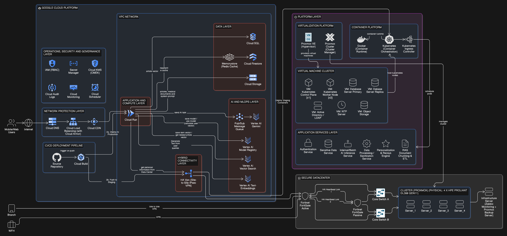
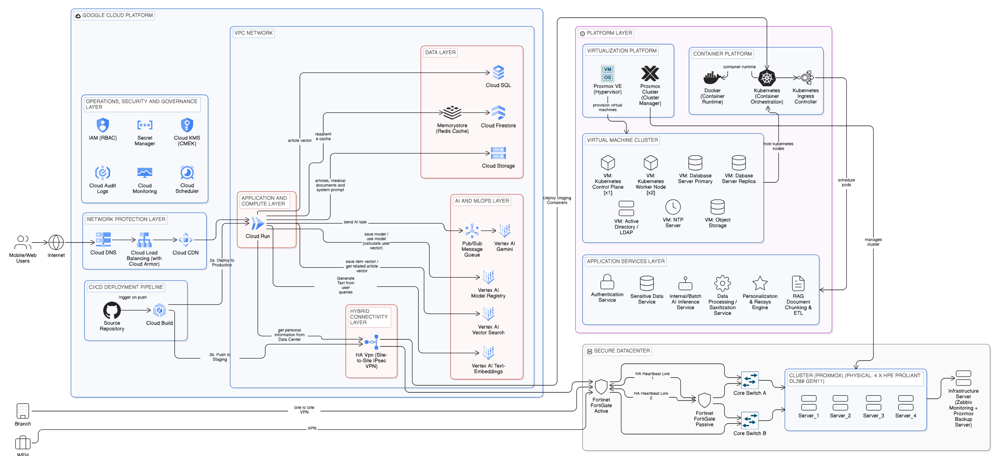
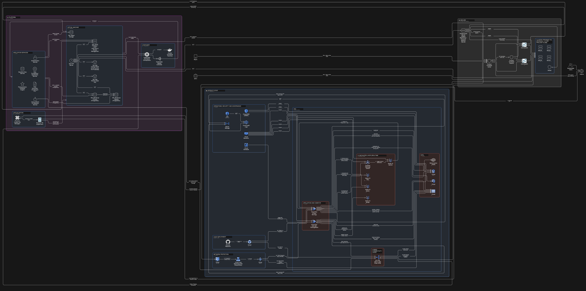
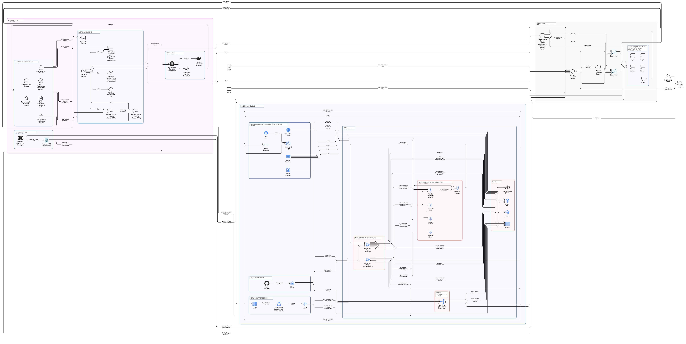

# Overview

แพลตฟอร์ม MotherNest ถูกสร้างขึ้นบนโครงสร้างพื้นฐานที่ทันสมัยและเป็นแบบ Highly Resilient โดยออกแบบมาเพื่อสร้างสมดุลระหว่าง Rapid Scalability และข้อกำหนดด้าน Data Privacy ที่เข้มงวด ระบบนี้ได้ปรับเปลี่ยนจากรูปแบบ Monolithic Architecture มาใช้แนวทาง Distributed Cloud-Native ที่ปรับแต่งมาสำหรับภาระงานสาย Health-tech โดยเฉพาะ

#### Design Methodology

สถาปัตยกรรมโดยรวมถูกออกแบบภายใต้ระเบียบวิธีและแนวคิดหลัก 3 ประการ:

* Hybrid Cloud Architecture: โครงสร้างพื้นฐานถูกแบ่งส่วนการทำงานอย่างมียุทธศาสตร์ ระหว่าง Public Cloud (Google Cloud Platform) สำหรับ Edge Delivery และ Scalable Compute ผสานกับ On-Premise Secure Datacenter สำหรับประมวลผล Sensitive Workloads
* Microservices Architecture: Application Logic ถูกแยกส่วนออกจากกันเป็น Microservices อิสระในรูปแบบ Container (เช่น Authentication, Recommendation และ AI Inference) โดยใช้ Kubernetes เป็นแพลตฟอร์มในการทำ Orchestration
* High Availability และ Fault Tolerance: ระบบถูกออกแบบให้มี Redundancy ในทุกเลเยอร์สำคัญของ Network และ Data ซึ่งรวมถึงการตั้งค่า Active-Passive Firewall Cluster, การทำ Proxmox Clustering สำหรับ Hardware Virtualization และการทำ Read-Write Splitting สำหรับฐานข้อมูล PostgreSQL

#### Strategic Rationale

โครงสร้างสถาปัตยกรรมนี้ถูกเลือกใช้เพื่อตอบโจทย์ความท้าทายเฉพาะตัวของแอปพลิเคชัน Health-tech สมัยใหม่ ที่ต้องรองรับผู้ใช้งานระดับ 1,000 คนต่อวัน:

1. PDPA Compliance และ Security ขั้นสูงสุด: ข้อมูลด้านสุขภาพต้องการการรักษาความลับในระดับสูงสุด การใช้โมเดล Hybrid Cloud ช่วยให้ MotherNest สามารถเก็บ Medical Records และ User Profiles ไว้ใน On-Premise Secure Datacenter เท่านั้น ส่วนประกอบบน Public Cloud จะเข้าถึงข้อมูลเหล่านี้ได้อย่างปลอดภัยผ่านระบบเข้ารหัส HA VPN Tunnel เฉพาะในกรณีที่จำเป็นจริงๆ ช่วยลด Attack Surface ได้อย่างมาก
2. Cost-Effective Scalability: ทราฟฟิกของผู้ใช้งานและกระบวนการทำงานของ Asynchronous ML Pipeline มักจะมีความผันผวน การเลือกใช้ Serverless Compute (Cloud Run) และ Managed Message Queue (Pub/Sub) บน GCP ช่วยให้ระบบสามารถ Auto-scale ทรัพยากรจากศูนย์ถึงระดับสูงสุดได้โดยอัตโนมัติ ซึ่งช่วยดึงภาระงานออกจาก Local Datacenter และบริหาร Operational Costs ได้อย่างมีประสิทธิภาพ
3. Performance และ Latency Optimization: เพื่อสร้าง Seamless User Experience ระบบได้ติดตั้ง Cloud CDN ไว้หลัง Global Load Balancer ทันที เพื่อให้บริการ Static Assets จาก Edge Nodes นอกจากนี้ การทำ Read-Write Splitting ยังช่วยป้องกันไม่ให้คิวรีที่ซับซ้อนของ AI Data Ingestion หรือ User Feed Generation ไปดึงทรัพยากรหรือล็อคฐานข้อมูลหลัก ทำให้ Critical Transactions ไม่เกิดความล่าช้า
4. Future-Proof AI Integration: ระบบจงใจใช้หลักการ Separation of Concerns โดยแยก MLOps Pipeline และ AI Inference Service ออกจากการทำงานหลักอย่างชัดเจน เพื่อให้มั่นใจว่ากระบวนการที่กินทรัพยากรสูง เช่น Vector Similarity Search หรือ LLM Generation จะไม่ไปแย่งทรัพยากรของแอปพลิเคชันหลัก และช่วยให้ทีมสามารถสลับหรืออัปเกรด AI Models ในอนาคตได้อย่างไร้รอยต่อโดยไม่เกิด Application Downtime

### Overall System Diagram

#### Simplified Version

<figure><figcaption></figcaption></figure>

<figure><figcaption></figcaption></figure>

#### Full Version

<figure><figcaption></figcaption></figure>

<figure><figcaption></figcaption></figure>


[private-data-center-design](private-data-center-design/)



[cloud-deployments.md](cloud-deployments.md)



[mlops-architecture.md](mlops-architecture.md)



[ci-cd-and-devsecops.md](ci-cd-and-devsecops.md)



[storage-distribution-management.md](storage-distribution-management.md)

