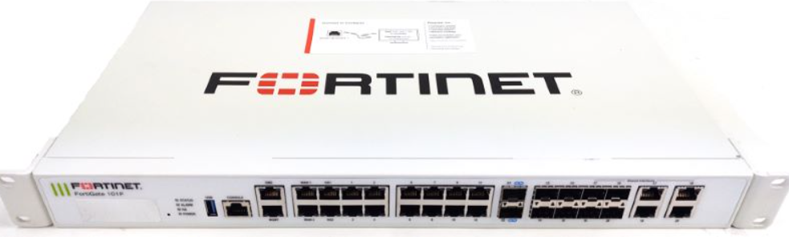
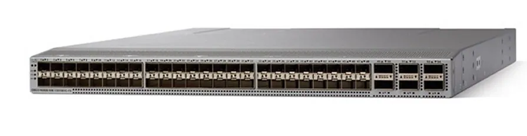

# Server and Storage Equipment

อุปกรณ์โครงสร้างพื้นฐานไอที (On-Premise Infrastructure) ชุดนี้ ได้รับการออกแบบมาเพื่อทำหน้าที่เป็น ศูนย์ข้อมูลความปลอดภัยสูง (Zone 0: Secure Datacenter) สำหรับโครงการ MotherNest โดยมีเป้าหมายหลักในการจัดเก็บข้อมูลสุขภาพส่วนบุคคล (PDPA Compliance) และรองรับการประมวลผลฐานข้อมูล Vector Database สำหรับระบบ AI

สถาปัตยกรรมฮาร์ดแวร์ถูกจัดเตรียมภายใต้งบประมาณ 2,631,504 บาท ประกอบด้วยเซิร์ฟเวอร์ประสิทธิภาพสูงจำนวน 5 ชุด (แบ่งเป็น Compute Cluster และ Backup Node), อุปกรณ์รักษาความปลอดภัย (Next-Gen Firewall) แบบ High Availability จำนวน 2 ชุด, และ Network Switch ระดับศูนย์ข้อมูลจำนวน 2 ชุด เพื่อสร้างโครงสร้างพื้นฐานที่ไร้จุดหย่อนคล้อย (Zero Single Point of Failure) และเชื่อมต่อกับ Google Cloud Platform ผ่าน HA VPN ได้อย่างมีประสิทธิภาพ

## HPE ProLiant DL380 Gen11

<figure><figcaption></figcaption></figure>

#### source : [https://www.hpe.com/psnow/doc/a50004307enw.pdf](https://www.hpe.com/psnow/doc/a50004307enw.pdf)

<table><thead><tr><th width="139.84619140625">ประเภท</th><th width="336.61541748046875">spec</th><th width="115.53857421875">ราคาต่อชิ้น (บาท)</th><th width="107.29193115234375">จำนวนชิ้น (ชิ้น)</th></tr></thead><tbody><tr><td>Virtualization &#x26; Compute Servers</td><td>
<strong>CPU</strong>
<ul><li>Intel Xeon Gold 5418Y 24 Cores / 48 Threads</li></ul>
<strong>RAM</strong>
<ul><li>128GB (8 × 16 GB DDR5 RDIMM)</li></ul>
<strong>STORAGE</strong>
<ul><li>Tier 1 : 2 × 480GB NVMe RAID 1</li><li>Tier 2 : 4 × 960GB SAS SSD RAID 10</li><li>Tier 3 : 2 × 4TB HDD RAID 1</li></ul></td><td>453,450</td><td>4</td></tr><tr><td>Infrastructure Servers (Monitoring &#x26; Backup)</td><td>
<strong>CPU</strong>
<ul><li>Intel Xeon Gold 5418Y 8 Cores</li></ul>
<strong>RAM</strong>
<ul><li>32 GB RDIMM 2R 4800 MT/s (1x 32 GB)</li></ul>
<strong>STORAGE</strong>
<ul><li>4 × 4TB HDD RAID 1</li></ul></td><td>238,600</td><td>1</td></tr></tbody></table>

## Fortinet FortiGate 101F

<figure><figcaption></figcaption></figure>

#### source : [https://www.router-switch.com/pdf/fg-101f-datasheet.pdf](https://www.router-switch.com/pdf/fg-101f-datasheet.pdf?utm_source=chatgpt.com)

<table><thead><tr><th width="115.69232177734375">ประเภท</th><th width="260.3076171875">spec</th><th>Operating System</th><th>Software</th><th width="133.3846435546875">ราคาต่อชิ้น (บาท)</th><th width="102.615478515625">จำนวน (ชิ้น)</th></tr></thead><tbody><tr><td>Firewall</td><td>
Firewall Throughput
<ul><li>20 / 18 / 10 Gbps (1518/512/64 byte)</li></ul>
Threat Protection
<ul><li>1 Gbps</li></ul>
IPsec VPN
<ul><li>11.5 Gbps (512-byte)</li></ul>
SSL VPN
<ul><li>750 Mbps</li></ul></td><td>FortiOS</td><td>FortiGuard Unified Threat Protection (UTP) License</td><td>221,000</td><td>2</td></tr></tbody></table>

## Cisco Nexus 93180YC-FX

<figure><figcaption></figcaption></figure>

#### source : [https://www.cisco.com/c/en/us/support/switches/nexus-93180yc-fx-switch/model.html](https://www.cisco.com/c/en/us/support/switches/nexus-93180yc-fx-switch/model.html)

<table><thead><tr><th width="155.69232177734375">ประเภท</th><th width="369.5384521484375">spec</th><th width="140.753662109375">Operating System</th><th>Software</th><th width="115.84619140625">ราคาต่อชิ้น (บาท)</th><th width="104.923095703125">จำนวน (ชิ้น)</th></tr></thead><tbody><tr><td>Network Switch</td><td>
Port Density
<ul><li>48 x 1/10/25G SFP28 + 6 x 100G QSFP28</li></ul>
Switching Capacity
<ul><li>3.6 Tbps</li></ul>
Power Redundancy
<ul><li>Dual Hot-swappable PSU</li></ul></td><td>Cisco NX-OS (Standalone Mode)</td><td>NX-OS Essentials</td><td>68,552</td><td>2</td></tr></tbody></table>

### ราคารวม = 2,631,504

#### 💡 การตัดสินใจเชิงวิศวกรรมสถาปัตยกรรม (Architectural Justifications)

เพื่อให้สอดคล้องกับมาตรฐานความปลอดภัยและรองรับปริมาณการประมวลผล AI ของโครงการ MotherNest การเลือกใช้อุปกรณ์ระดับ Enterprise ทั้ง 4 ส่วนนี้ มีเหตุผลสนับสนุนเชิงวิศวกรรมดังต่อไปนี้:

1\. การจัดสรรเซิร์ฟเวอร์ประมวลผลแบบ 4+1 Nodes (Compute & Backup Separation)

* เหตุผล: การจัดซื้อ HPE DL380 Gen11 รุ่นสเปกสูงจำนวน 4 เครื่อง เพื่อทำหน้าที่เป็น Compute Cluster ช่วยรับประกันว่าระบบมีทรัพยากร CPU (48 Threads/เครื่อง) เพียงพอสำหรับการทำ Virtualization และรองรับ High Availability (N+1) หากมีเซิร์ฟเวอร์เครื่องใดเครื่องหนึ่งปิดซ่อมบำรุง ระบบจะยังทำงานได้เต็มประสิทธิภาพ
* ในขณะเดียวกัน การแยกเซิร์ฟเวอร์เครื่องที่ 5 (สเปกประหยัดกว่า เน้นพื้นที่ HDD) ออกมาเพื่อทำระบบ Backup และ Monitoring ถือเป็นการปฏิบัติตามหลักการ Fault Domain Isolation หาก Compute Cluster ล่มทั้งหมด เซิร์ฟเวอร์สำรองข้อมูลจะยังคงปลอดภัยและพร้อมสำหรับการทำ System Restore ทันที

2\. การใช้สถาปัตยกรรม Storage แบบ Tiering (NVMe + SSD + HDD)

* เหตุผล: ระบบฐานข้อมูล PostgreSQL ควบรวมกับ pgvector (สำหรับ AI Retrieval) ต้องการความเร็วในการอ่านเขียน (I/O) ที่สูงมากเพื่อค้นหาบริบทแพทย์แบบเรียลไทม์
* ผลลัพธ์: การออกแบบเซิร์ฟเวอร์โดยแบ่ง Storage เป็น 3 ระดับ (Tier 1 NVMe สำหรับระบบปฏิบัติการและแคช, Tier 2 SAS SSD แบบ RAID 10 สำหรับฐานข้อมูลหลัก, และ Tier 3 HDD สำหรับล็อก) เป็นการทำ Cost-Performance Optimization ที่ช่วยรีดความเร็วของระบบฐานข้อมูลออกมาได้สูงสุด โดยไม่ต้องสิ้นเปลืองงบประมาณไปกับการซื้อ NVMe ความจุสูงทั้งหมด

3\. การเลือกใช้ FortiGate 101F สำหรับ Hybrid Cloud Connectivity

* เหตุผล: สถาปัตยกรรมของโครงการบังคับให้ RAG Orchestrator บน GCP ต้องดึงข้อมูลผ่าน VPN ตลอดเวลา หาก Firewall คอขวด (Bottleneck) แชทบอทจะตอบสนองช้าทันที
* ผลลัพธ์: FortiGate 101F มาพร้อมกับชิปประมวลผลเฉพาะทางที่ให้ความเร็ว IPsec VPN สูงถึง 11.5 Gbps ซึ่งเกินพอสำหรับปริมาณทราฟฟิกของการส่งข้อมูลเวกเตอร์ นอกจากนี้ การจัดซื้อ 2 ชุดเพื่อทำโหมด Active-Passive HA พร้อมไลเซนส์ UTP (Unified Threat Protection) ยังตอบโจทย์การป้องกันภัยคุกคามระดับแอปพลิเคชัน (IPS/IDS) สอดคล้องกับมาตรฐานความปลอดภัยด้าน Health-Tech อย่างสมบูรณ์

4\. การเลือกใช้ Cisco Nexus 93180YC-FX ในระดับ Core Switch

* เหตุผล: การสื่อสารระหว่างเซิร์ฟเวอร์ฐานข้อมูล (East-West Traffic) เช่น การทำ Database Replication ระหว่าง Primary และ Replica รวมถึงการทำ Live Migration ของ VM ต้องการแบนด์วิดท์เครือข่ายภายในที่สูงมาก
* ผลลัพธ์: สวิตช์ตระกูล Cisco Nexus ออกแบบมาเพื่อ Data Center โดยเฉพาะ การมีพอร์ตระดับ 10/25Gbps (SFP28) ถึง 48 พอร์ต พร้อม Switching Capacity 3.6 Tbps ช่วยขจัดปัญหาความหน่วงในเครือข่าย (Network Latency) และการมีสวิตช์ 2 ตัวที่มีระบบ Power Redundancy จะช่วยให้เครือข่ายภายในศูนย์ข้อมูลไม่มีวันล่มแม้มีสวิตช์ตัวใดตัวหนึ่งเสียหาย
