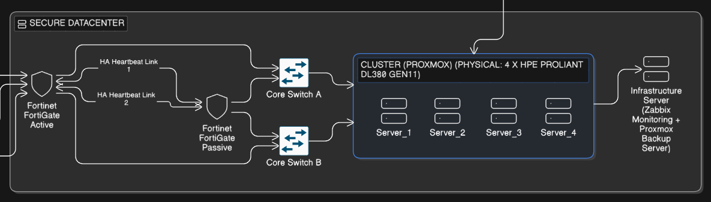
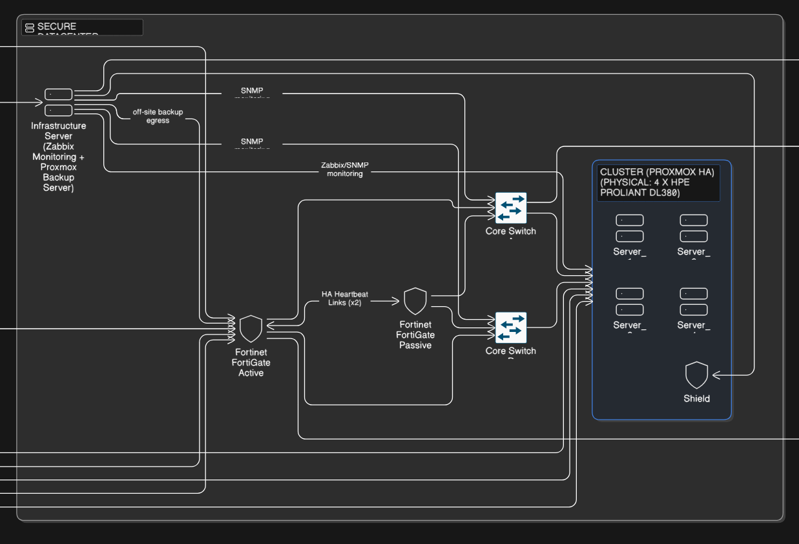
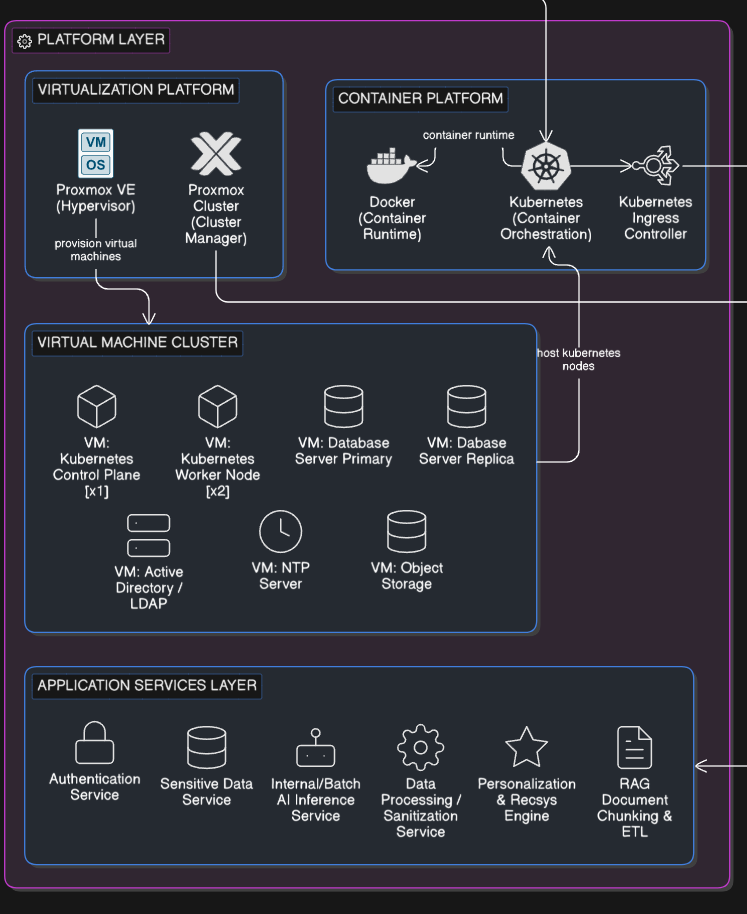
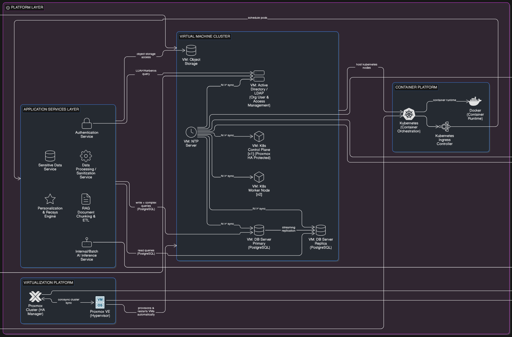

# Server Management

#### Simplified Diagram

<figure><figcaption></figcaption></figure>

#### Full Diagram

<figure><figcaption></figcaption></figure>

## Physical Servers

| Type                                         | CPU                                         | Storage                                                                               | Operating System | Software                       |
| -------------------------------------------- | ------------------------------------------- | ------------------------------------------------------------------------------------- | ---------------- | ------------------------------ |
| Virtualization & Compute Servers             | Intel Xeon Gold 5418Y 24 Cores / 48 Threads | 
2 × 480GB NVMe RAID 1

4 × 960GB SAS SSD RAID 10

2 × 4TB HDD RAID 1
 | Rocky Linux 9    | -                              |
| Infrastructure Servers (Monitoring & Backup) | Intel Xeon Gold 5418Y 8 Cores               | 4 × 4TB HDD RAID 1                                                                    | Rocky Linux 9    | Zabbix + Proxmox Backup Server |

## Virtual Machine Cluster

<table><thead><tr><th width="162.04296875" valign="middle">VM Type</th><th width="277.9765625">Usage</th><th width="105.09765625">Amount</th><th width="167.90625">Operating System</th><th>Software</th></tr></thead><tbody><tr><td valign="middle">K8s Control</td><td>สั่งการและควบคุมดูแลความเรียบร้อยของ Kubernetes ทั้งหมด</td><td>1</td><td>Ubuntu Server 24.04 LTS</td><td>kubeadm, containerd, Etcd</td></tr><tr><td valign="middle">K8s Worker</td><td>เป็นพื้นที่สำหรับรัน Containersในชั้น Application Services Layer</td><td>2</td><td>Ubuntu Server 24.04 LTS</td><td>Kubelet, Kube-proxy, Docker Runtime</td></tr><tr><td valign="middle">Database Primary</td><td>เป็นฐานข้อมูลหลักสำหรับการเขียนข้อมูล (Write Operations) และเก็บข้อมูลที่ต้องการความถูกต้องสูง (ACID Compliance) เช่น ข้อมูลสุขภาพและบัญชีผู้ใช้งาน</td><td>1</td><td>Ubuntu Server 24.04 LTS</td><td>PostgreSQL 16, pgvector, pgBouncer</td></tr><tr><td valign="middle">Database Replica</td><td>รองรับการอ่านข้อมูล และทำ Vector Search สำหรับ AI เพื่อลดภาระเครื่อง Primary ไม่ให้ระบบหน่วง</td><td>1</td><td>Ubuntu Server 24.04 LTS</td><td>PostgreSQL 16, pgvector, pgBouncer</td></tr><tr><td valign="middle">Object Storage</td><td>ใช้สำหรับเก็บไฟล์ขนาดใหญ่แบบ On-premise เช่น รูปภาพโปรไฟล์ชั่วคราว หรือไฟล์ Log ก่อนที่จะถูก Sync ขึ้นไปสำรองบน Cloud Storage เพื่อความรวดเร็วในการเข้าถึงภายในเครือข่าย</td><td>1</td><td>Ubuntu Server 24.04 LTS</td><td>MinIO</td></tr><tr><td valign="middle">Active Directory / LDAP</td><td>จัดการสิทธิ์การเข้าถึง (RBAC) และการยืนยันตัวตนของเจ้าหน้าที่ในองค์กรที่เข้ามาดูแลระบบทั้งหมดแบบรวมศูนย์</td><td>2</td><td>Ubuntu Server (Samba4)</td><td>Active Directory Domain Services (AD DS), LDAPS</td></tr></tbody></table>

## Application Services Layer

| **Service Name**        | **Usage (Details)**                                            | **CPU (vCPU)** | **RAM (GB)** | **Deployment Type**         |
| ----------------------- | -------------------------------------------------------------- | -------------- | ------------ | --------------------------- |
| Authentication Service  | จัดการระบบ Login, ออก JWT Token และตรวจสอบสิทธิ์ (RBAC)        | 0.5 - 1.0      | 0.5 - 1.0    | Kubernetes Deployment (HPA) |
| Sensitive Data Service  | ประมวลผลและเข้ารหัสข้อมูลสุขภาพ (Medical Data) ตามมาตรฐาน PDPA | 1.0 - 1.5      | 1.0 - 2.0    | Kubernetes Deployment       |
| Recommendation Service  | คำนวณลำดับบทความและเนื้อหาเฉพาะบุคคล (Personalized Content)    | 1.5 - 2.0      | 2.0 - 4.0    | Kubernetes Deployment (HPA) |
| AI Inference Service    | รันโมเดลภาษาขนาดเล็ก (SLM) และประมวลผลเวกเตอร์ (SBERT/MLP)     | 2.0 - 4.0      | 4.0 - 8.0    | Kubernetes Deployment (VPA) |
| RAG Ingestion Service   | ทำ Data Pipeline หั่นข้อความ (Chunking) และสร้าง Vector Index  | 1.0 - 2.0      | 2.0 - 4.0    | Kubernetes Job / CronJob    |
| Data Processing Service | ทำความสะอาดและจัดระเบียบข้อมูล (ETL) ก่อนบันทึกลงฐานข้อมูล     | 1.0 - 1.5      | 1.0 - 2.0    | Kubernetes Deployment       |

## On-Premise Infrastructure Overview

### Secure Datacenter

#### Simplified

<figure><figcaption></figcaption></figure>

#### Full

<figure><figcaption></figcaption></figure>

Secure Datacenter ทำหน้าที่เป็นโครงสร้างพื้นฐานทางกายภาพ (Physical Infrastructure) ที่มีความปลอดภัยสูง เพื่อรองรับระบบ On-Premise และเก็บรักษาข้อมูลสุขภาพที่มีความละเอียดอ่อนของโครงการ MotherNest:

* High-Performance Computing Cluster: ประกอบด้วยเซิร์ฟเวอร์ประสิทธิภาพสูงจำนวน 4 เครื่อง (HPE ProLiant Gen11) ซึ่งถูกออกแบบมาให้ทำงานร่วมกันในรูปแบบ Cluster เพื่อกระจายภาระงานและรองรับระบบ Virtualization อย่างเต็มรูปแบบ
* Network Redundancy with Dual Core Switches: เซิร์ฟเวอร์ทั้งหมดเชื่อมต่อกับเครือข่ายภายในผ่าน Core Switch จำนวน 2 ตัว (Core Switch A และ Core Switch B) แบบ Cross-connect เพื่อป้องกันจุดอ่อนที่อาจทำให้ระบบล่ม (Single Point of Failure) หากสวิตช์ตัวใดตัวหนึ่งขัดข้อง ระบบจะยังคงสามารถสื่อสารผ่านสวิตช์อีกตัวได้ทันทีโดยไม่หยุดชะงัก
* Enterprise Edge Security: ระบบติดตั้ง Fortinet FortiGate Firewall จำนวน 2 เครื่อง ทำงานร่วมกันในโหมด Active–Passive High Availability (HA):
  * Perimeter Protection: ทำหน้าที่เป็นด่านหน้าในการกรองทราฟฟิกและป้องกันภัยคุกคามทางไซเบอร์ (IPS/Antivirus/Web Filtering)
  * Continuous Availability: หาก Firewall เครื่องหลักเกิดความล้มเหลว เครื่องสำรองจะเข้ารับช่วงต่อทันที (Seamless Failover) เพื่อรักษาความปลอดภัยของเครือข่ายอย่างต่อเนื่อง
* Hybrid Cloud Connectivity: Firewall ทำหน้าที่สร้าง Site-to-Site VPN (HA VPN) เพื่อสร้างอุโมงค์สื่อสารที่เข้ารหัสข้อมูล (Encrypted Tunnel) ระหว่าง Datacenter และ Google Cloud Platform (GCP) ทำให้การรับส่งข้อมูลระหว่างส่วนประมวลผลบน Cloud และฐานข้อมูล On-Premise เป็นไปอย่างปลอดภัยตามมาตรฐาน PDPA
* Centralized Infrastructure Management: ภายในระบบมี Infrastructure Server ที่แยกการทำงานออกมาเพื่อทำหน้าที่สนับสนุนความเสถียรของระบบโดยเฉพาะ:
  * Zabbix Monitoring: เฝ้าระวังสถานะการทำงาน (Health Check) ของฮาร์ดแวร์และเครือข่ายทั้งหมดแบบ Real-time
  * Proxmox Backup Server (PBS): จัดการการสำรองข้อมูลของ Virtual Machines ทั้งหมดแบบ Incremental และทำ Deduplication เพื่อให้สามารถกู้คืนระบบได้อย่างรวดเร็วในกรณีฉุกเฉิน

### Platform Layer

#### Simplified

<figure><figcaption></figcaption></figure>

#### Full

<figure><figcaption></figcaption></figure>

#### Virtualization Platform

โครงสร้างพื้นฐานในส่วนของ Computing ทั้งหมดถูกบริหารจัดการผ่าน Virtualization Platform ที่มีความยืดหยุ่นสูง โดยใช้ Proxmox Virtual Environment (Proxmox VE) เป็นแกนหลักในการทำ Type-1 Hypervisor เพื่อจัดสรรทรัพยากรฮาร์ดแวร์ให้เกิดประสิทธิภาพสูงสุด (Resource Optimization)

**1. Proxmox Cluster & Centralized Management**

เซิร์ฟเวอร์กายภาพ (Physical Servers) ทั้ง 4 เครื่อง ถูกนำมาทำ Proxmox Cluster เพื่อรวมทรัพยากร CPU, Memory และ Network เข้าด้วยกันเป็น Pool เดียว โดยบริหารจัดการผ่าน Proxmox Cluster Manager ซึ่งทำหน้าที่เป็นศูนย์กลางในการควบคุม Virtual Machines (VMs) ทั้งหมด ภายในส่วนนี้ ระบบสามารถกำหนดตำแหน่งการวาง Workloads (เช่น Kubernetes Nodes หรือ DB Servers) ลงบนเครื่องที่มีทรัพยากรเหมาะสมที่สุดได้อย่างอัตโนมัติ

**2. Software-Defined Storage with Ceph**

เพื่อให้รองรับการทำงานแบบ High Availability (HA) ระบบได้เลือกใช้ Ceph Storage ซึ่งเป็น Hyper-converged Storage (HCI) ที่ Built-in มากับ Proxmox VE โดย Ceph จะทำหน้าที่กระจายข้อมูลของ VMs ไปยังดิสก์ของทุกเซิร์ฟเวอร์ใน Cluster (Distributed Storage) ทำให้ข้อมูลมีความซ้ำซ้อน (Redundancy) และปลอดภัยจากการสูญหาย แม้จะมีเซิร์ฟเวอร์เครื่องใดเครื่องหนึ่งหยุดทำงาน ข้อมูลก็ยังคงพร้อมใช้งานจากเครื่องอื่นใน Cluster ทันที

**3. High Availability (HA) & Live Migration**

ด้วยการผสานพลังระหว่าง Cluster Manager และ Ceph Shared Storage ทำให้ระบบ MotherNest มีคุณสมบัติเด่น 2 ประการ:

* Live Migration: ความสามารถในการย้าย VMs ระหว่างเซิร์ฟเวอร์กายภาพได้แบบ Real-time โดยไม่เกิด Downtime (Zero Downtime) เพื่อการปรับสมดุลภาระงาน (Load Balancing) หรือการปิดซ่อมบำรุงฮาร์ดแวร์
* Automatic Failover: ในกรณีที่เซิร์ฟเวอร์เครื่องหลักเกิดความล้มเหลว (Hardware Failure) ระบบ Proxmox HA Manager จะทำการ Restart บริการของ VMs นั้น ๆ บนเซิร์ฟเวอร์เครื่องอื่นภายใน Cluster โดยอัตโนมัติ เพื่อให้แอปพลิเคชัน MotherNest สามารถให้บริการได้อย่างต่อเนื่อง (Business Continuity)

**4. Proxmox Backup Server (PBS)**

นอกจากการทำ Redundancy ในระดับ Cluster แล้ว ระบบยังเชื่อมต่อกับ Proxmox Backup Server เพื่อทำ Incremental Backups ของ VMs ทั้งหมดแบบรายวัน ช่วยให้สามารถย้อนคืนสถานะระบบ (Rollback) ได้อย่างรวดเร็วในกรณีที่เกิดความผิดพลาดในระดับซอฟต์แวร์หรือการโจมตีทางไซเบอร์

#### Virtual Machine Cluster

Virtual Machine Cluster ทำหน้าที่เป็นสภาพแวดล้อมสำหรับการประมวลผลหลักของระบบ โดย VMs เหล่านี้ถูกสร้างขึ้นบน Proxmox VE ซึ่งทำหน้าที่เป็น High Availability (HA) Hypervisor เพื่อรองรับการทำงานของ Kubernetes Cluster และบริการโครงสร้างพื้นฐานที่สำคัญ (Critical Infrastructure Services) ดังนี้:

**1. Kubernetes Platform Layer**

* Kubernetes Control Plane Nodes (`VM_K8s_Master`): ทำหน้าที่เป็นส่วนสมองของ Cluster ในการบริหารจัดการสถานะของระบบ (Desired State), ควบคุมการทำงานของ Components ต่าง ๆ และตัดสินใจจัดสรร Workloads ไปยัง Worker Node ที่เหมาะสม
* Kubernetes Worker Nodes (`VM_K8s_Worker`): ทำหน้าที่เป็นพื้นที่ประมวลผลสำหรับ Containerized Applications โดย Kubernetes จะทำการ Schedule แซลเคิล (Pods) มายัง Node เหล่านี้ เพื่อรันบริการ Microservices ของ MotherNest อย่างมีประสิทธิภาพ

**2. Database & Storage Layer**

* Database Primary & Replica Servers: ระบบใช้สถาปัตยกรรม Read-Write Splitting โดยแบ่งเป็น:
  * Primary Server (`VM_K8s_DB_Pri`): สำหรับจัดการธุรกรรมการเขียนข้อมูล (Write Operations) ทั้งหมดเพื่อให้เกิด Data Integrity สูงสุด
  * Replica Server (`VM_K8s_DB_Rep`): สำหรับรองรับการอ่านข้อมูล (Read Queries) และงานประมวลผลหนัก เช่น Vector Similarity Search สำหรับ AI เพื่อลดภาระ (Offloading) ไม่ให้กระทบต่อประสิทธิภาพของฐานข้อมูลหลัก
* Object Storage Server (`VM_K8s_OBJ`): ใช้สำหรับจัดเก็บข้อมูลที่ไม่มีโครงสร้าง (Unstructured Data) เช่น ไฟล์รูปภาพทางการแพทย์ และ Model Artifacts สำหรับ AI Inference ภายในเครือข่าย On-premise

**3. Essential Infrastructure Services**

* Active Directory / LDAP Server (`VM_AD`): ทำหน้าที่เป็นระบบจัดการอัตลักษณ์ (Identity Management) และควบคุมสิทธิ์การเข้าถึง (RBAC) แบบรวมศูนย์ สำหรับเจ้าหน้าที่และวิศวกรที่เข้ามาดูแลระบบ เพื่อความปลอดภัยตามมาตรฐานสากล
* NTP Server (`VM_NTP`): ทำหน้าที่เป็น Single Source of Truth สำหรับการประสานเวลา (Time Synchronization) ของทุกอุปกรณ์ในระบบ ซึ่งมีความสำคัญอย่างยิ่งต่อความถูกต้องของ Audit Logs, การตรวจสอบ SSL Certificates และการทำ Database Replication ที่ต้องอาศัยความแม่นยำของเวลาในระดับวินาที

แม้ว่า VMs ทั้งหมดจะถูกสร้างขึ้นภายใต้ Proxmox VE แต่มีการจัดแบ่งกลุ่มการทำงานอย่างชัดเจนระหว่างส่วนที่รัน Containerized Applications และส่วนที่ให้บริการโครงสร้างพื้นฐาน เพื่อให้ระบบ MotherNest มีความเสถียร (Stability) และความปลอดภัย (Security) สูงสุดตามการออกแบบ Hybrid Cloud

#### Container Platform

Container Platform ทำหน้าที่เป็นโครงสร้างพื้นฐานในการบริหารจัดการแอปพลิเคชันรูปแบบ Containerized ภายในระบบ เพื่อให้เกิดความยืดหยุ่นในการปรับขยายและง่ายต่อการดูแลรักษา:

* Container Orchestration with Kubernetes: ระบบใช้ Kubernetes ในการควบคุมและดูแลสถานะของระบบ (Desired State) โดยทำหน้าที่ Deploy และจัดสรร Load (Scheduling) ของ Pods ไปยัง Kubernetes Worker Nodes (VMs) ตามทรัพยากรที่เหมาะสมที่สุด
* Modern Container Runtime: ภายในแต่ละ Node จะใช้งาน containerd เป็น Container Runtime มาตรฐาน (แทนที่ Docker Runtime แบบเดิม) เพื่อความรวดเร็วและประหยัดทรัพยากรในการรัน Containers ตามคำสั่งของ Kubernetes
* Elastic Scaling: Kubernetes รองรับการขยายตัวของบริการอย่างยืดหยุ่นผ่าน Horizontal Pod Autoscaler (HPA) และ Vertical Pod Autoscaler (VPA) ซึ่งจะเพิ่มหรือลดจำนวน Pods อัตโนมัติเบื้องหลังตามภาระงาน (Load) จริง ทำให้ระบบเสถียรแม้ในช่วงที่มีผู้ใช้งานหนาแน่น
* Ingress Controller (L7 Load Balancing): ระบบใช้งาน Ingress Controller ทำหน้าที่เป็นทางเข้าหลัก (Entry Point) ในระดับ Application Layer (HTTP/HTTPS) เพื่อทำหน้าที่ Routing คำร้องขอจากภายนอกไปยัง Services ต่าง ๆ ภายใน Cluster อย่างแม่นยำ

#### Application Services Layer

Application Services Layer คือส่วนประมวลผลทางลอจิกของ MotherNest โดยทุกบริการถูกพัฒนาในรูปแบบ Microservices และทำงานอยู่บน Kubernetes Cluster:

* Authentication Service: จัดการระบบ Login, การยืนยันตัวตน และการกำหนดสิทธิ์ (RBAC) โดยเชื่อมต่อกับระบบฐานข้อมูลเพื่อจัดการบัญชีผู้ใช้งานอย่างปลอดภัย
* Recommendation Service (Personalization): (หัวใจหลักของระบบ) ทำหน้าที่คำนวณและจัดลำดับเนื้อหา บทความ และกิจกรรมให้เหมาะสมกับคุณแม่แต่ละท่านแบบเฉพาะบุคคล (Personalization Engine) โดยวิเคราะห์จากข้อมูลพฤติกรรม ประวัติสุขภาพ และความสนใจ เพื่อให้ประสบการณ์การใช้งานตรงใจที่สุด
* Sensitive Data Service (PDPA Compliance): บริการพิเศษที่จัดการข้อมูลสุขภาพที่มีความละเอียดอ่อน มีหน้าที่เข้ารหัสข้อมูลและควบคุมสิทธิ์การเข้าถึงอย่างเข้มงวดตามมาตรฐาน PDPA ก่อนส่งไปประมวลผลต่อ
* AI Inference Service: \* AI\_Inference\_Service: ทำหน้าที่รันโมเดล AI เพื่อประมวลผลคำถามของคุณแม่ โดยโหลด Model Weights จาก Object Storage มาใช้งาน
* RAG Ingestion Service: จัดการกระบวนการหั่นข้อมูล (Chunking) และสร้าง Vector Embeddings เพื่อนำไปเก็บในฐานข้อมูลสำหรับการทำ Semantic Search
* Data Processing Service (Sanitization): ทำหน้าที่ตรวจสอบ กรอง และทำความสะอาดข้อมูล (Data Cleaning/Filtering) เพื่อให้มั่นใจว่าข้อมูลมีความถูกต้องและปลอดภัยก่อนถูกนำไปบันทึกหรือประมวลผลต่อในระบบ

## Security & Network Connectivity

ความปลอดภัยของข้อมูล (Data Security) และความเสถียรของการเชื่อมต่อเป็นหัวใจสำคัญของระบบ MotherNest โดยเฉพาะการสื่อสารระหว่าง On-Premise Secure Datacenter และ Google Cloud Platform (GCP)

**1. Edge Security with Fortinet FortiGate**

ระบบติดตั้ง Fortinet FortiGate Next-Generation Firewall (NGFW) ไว้ที่ขอบเขตเครือข่าย (Network Perimeter) เพื่อทำหน้าที่เป็นด่านหน้าในการป้องกันการโจมตี:

* High Availability (Active-Passive): ใช้ FortiGate จำนวน 2 เครื่องทำงานคู่กันในโหมด Active-Passive Cluster โดยมีการเชื่อมต่อ Heartbeat Link เพื่อเฝ้าระวังสถานะกันและกัน หากเครื่องหลัก (Active) ขัดข้อง เครื่องสำรอง (Passive) จะทำหน้าที่แทนทันที (Failover) เพื่อให้ระบบทำงานได้ต่อเนื่อง 24/7
* Intrusion Prevention System (IPS): ตรวจสอบและสกัดกั้นการบุกรุก บอทเน็ต และมัลแวร์ ก่อนที่จะเข้าถึงเซิร์ฟเวอร์ภายใน
* Deep Packet Inspection (DPI): ตรวจสอบทราฟฟิกที่เข้ารหัสเพื่อค้นหาความผิดปกติที่ซ่อนอยู่ภายใน HTTPS

**2. Hybrid Cloud Connectivity via HA VPN**

การรับส่งข้อมูลระหว่างส่วนประมวลผลบน Cloud และฐานข้อมูลใน Datacenter ถูกปกป้องด้วย HA VPN (High Availability VPN):

* Site-to-Site IPsec Tunnel: สร้างอุโมงค์ส่งข้อมูลที่เข้ารหัสในระดับสูงสุด (AES-256) เชื่อมต่อโดยตรงระหว่าง GCP และ FortiGate
* Dual Tunnels for Redundancy: มีการสร้าง VPN Tunnel อย่างน้อย 2 เส้นทางผ่าน Gateway ที่แตกต่างกัน เพื่อรองรับกรณีที่เส้นทางใดเส้นทางหนึ่งขัดข้อง ข้อมูลจะยังสามารถวิ่งผ่านอีกเส้นทางได้โดยไม่หลุดการเชื่อมต่อ
* PDPA Control Path: ข้อมูลสุขภาพ (Sensitive Data) จะถูกดึงผ่านอุโมงค์นี้เฉพาะเมื่อมีการเรียกใช้งานจริง (On-demand) และจะไม่ถูกเก็บสำเนาไว้บนคลาวด์สาธารณะอย่างถาวร

**3. Public Cloud Protection**

สำหรับส่วนที่ต้องเผชิญกับอินเทอร์เน็ต (Public-facing) ระบบใช้บริการของ GCP ในการเสริมความแข็งแกร่ง:

* Cloud Armor: ทำหน้าที่ป้องกันการโจมตีประเภท DDoS (Distributed Denial of Service) และ OWASP Top 10 (เช่น SQL Injection และ Cross-Site Scripting) ที่ระดับ Global Load Balancer
* Cloud KMS (Key Management Service): จัดเก็บและจัดการกุญแจเข้ารหัส (Encryption Keys) แบบรวมศูนย์ เพื่อใช้ในการเข้ารหัสข้อมูลที่เก็บอยู่ใน Cloud Storage และ Cloud SQL (Data-at-rest)
* Secret Manager: ใช้สำหรับจัดเก็บค่าคอนฟิกที่สำคัญ (เช่น API Keys และ Database Credentials) เพื่อให้ Microservices เรียกใช้งานได้อย่างปลอดภัยโดยไม่ต้องระบุไว้ในซอร์สโค้ด
