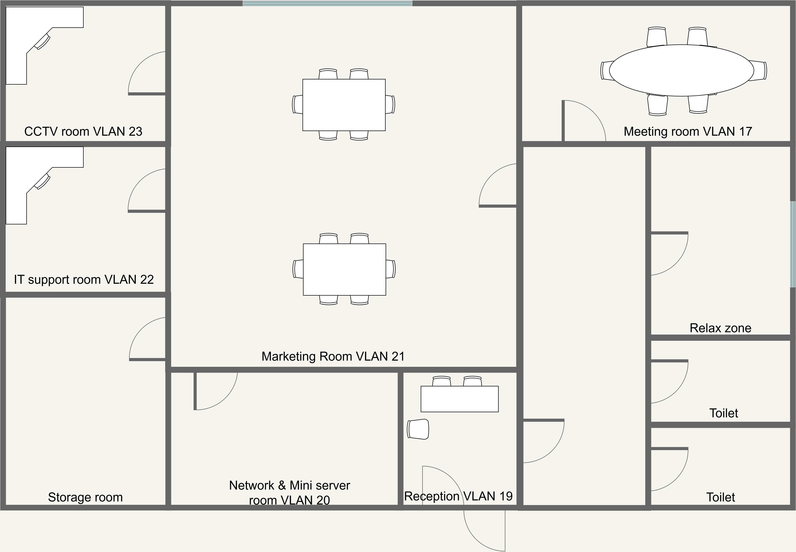

# Floor Plan

**This page outlines the floor plans for the headquarters and branch sites. It highlights the main rooms and work areas that support the campus network design.**

### Headquarters floor plan

The headquarters layout includes the main business, operations, and infrastructure areas.

<figure><figcaption></figcaption></figure>

#### Key areas

* Information Technology room
* Stock room
* Network Operation Center and Security Operation Center room
* Developer room
* Relax zone
* Reception
* Workspace for Human Resources, Marketing, and Finance
* Small meeting room
* Large meeting room
* Power control room
* Network room
* Data center
* Management room

### Branch floor plan

The branch layout supports daily operations and extends network access to the branch site.

<figure><figcaption></figcaption></figure>

#### Key areas

* Information Technology room
* Storage room
* Network and mini server room
* Reception
* Marketing room
* Relax zone
* CCTV room
* Meeting room
