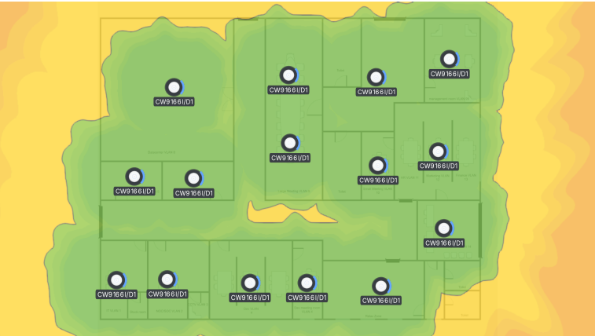
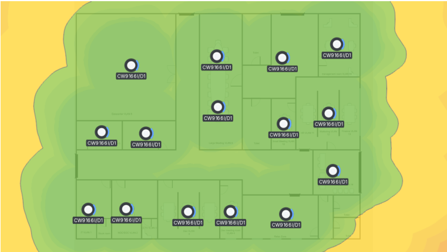
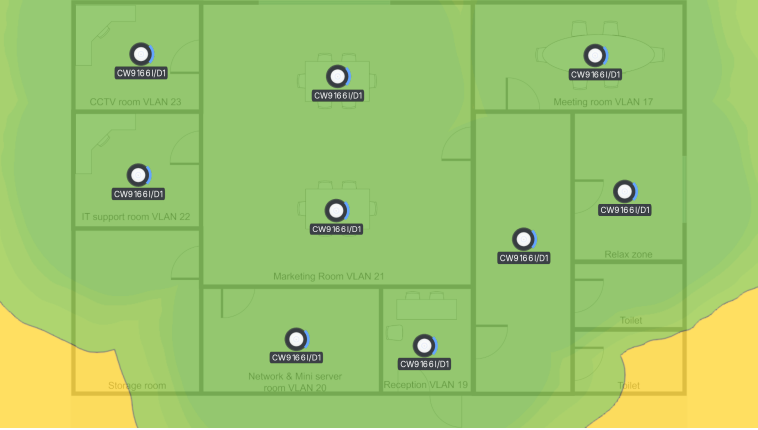
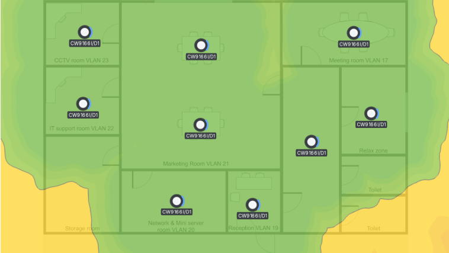

# Heat Map

**This page presents the Wi-Fi coverage heat maps for the headquarters and branch sites. It shows the expected wireless signal distribution for both 2.4 GHz and 5 GHz bands.**

### Headquarters wireless coverage

The headquarters heat maps show the estimated wireless coverage across key work areas and shared spaces.

#### 2.4 GHz wireless coverage

<figure><figcaption></figcaption></figure>

#### 5 GHz wireless coverage

<figure><figcaption></figcaption></figure>

### Branch wireless coverage

The branch heat maps show the estimated wireless coverage for local operations and common access areas.

#### 2.4 GHz wireless coverage

<figure><figcaption></figcaption></figure>

#### 5 GHz wireless coverage

<figure><figcaption></figcaption></figure>
