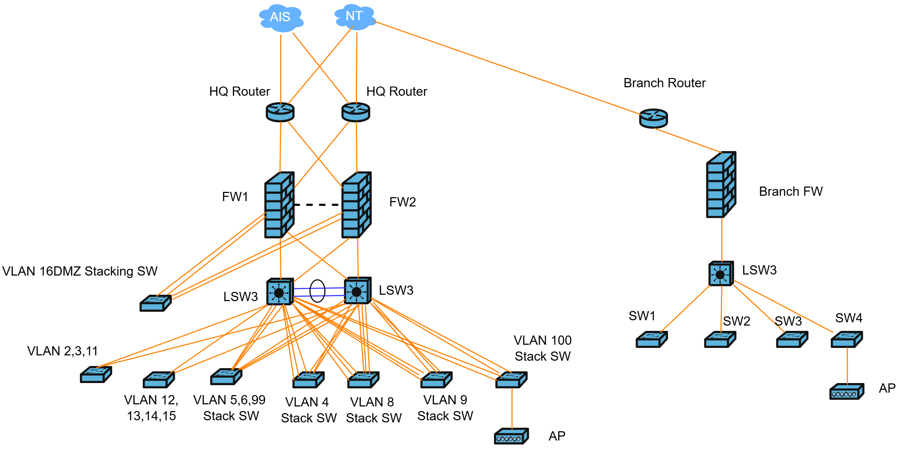

# Logical Topology

**Overview:** This logical topology shows an SD-WAN design for headquarters, branch, and work-from-home users using dual ISPs, **AIS** and **NT**, to provide redundancy, path selection, and secure connectivity.

### Logical Topology

<figure><figcaption></figcaption></figure>

### Summary

This topology uses **SD-WAN** to connect the headquarters, branch office, and work-from-home users over **AIS** and **NT** internet services.

At the headquarters, redundant routers, firewalls, and Layer 3 switches provide secure access, traffic control, and internal routing between VLANs.

At the branch, the edge router and firewall connect local users to the SD-WAN fabric and support secure communication with headquarters services.

Work-from-home users connect through the SD-WAN client over public internet, then reach internal applications through encrypted tunnels and access policies.

The dual-ISP design improves availability and supports automatic failover when one provider has an outage or poor performance.

SD-WAN policies can also select the best path for each application. Critical traffic such as voice, video, and business systems can use the better-quality link, while lower-priority traffic can use the lower-cost path.
