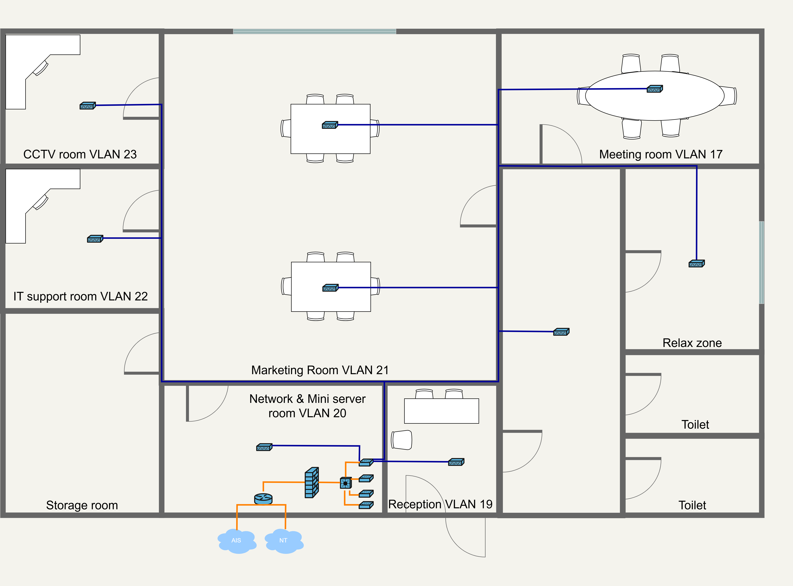

# Physical Topology

**This page presents the physical network topology for the headquarters and branch sites. It shows how network devices, rooms, and infrastructure are connected across each location.**

### Headquarters physical topology

The headquarters topology shows the physical placement of core network equipment and the main connection paths between operational areas.

<figure><figcaption></figcaption></figure>

### Branch physical topology

The branch topology shows the local network layout and the physical links that support daily branch operations.

<figure><figcaption></figcaption></figure>
