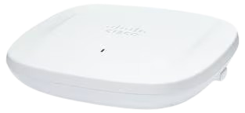

# Access Point

**This page presents the access point model used at the headquarters and branch sites. It summarizes the selected hardware and key specifications for each location.**

### Headquarters and Branch

The same access point model is used at both sites. The only difference is the deployment quantity.

Cisco Catalyst 9166 Access Point

<figure><figcaption></figcaption></figure>

#### Specifications

| Specification         | Detail                            |
| --------------------- | --------------------------------- |
| Throughput            | 3 Gbps                            |
| Client Capacity       | 30–60+ users                      |
| Amount (Headquarters) | 15                                |
| Amount (Branch)       | 9                                 |
| Price                 | \~44,000 THB                      |
| Data Sheet            | [Reference](https://cmu.to/4ONVZ) |
