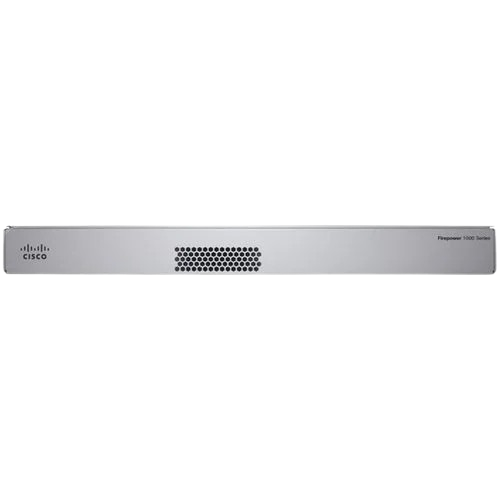

# Firewall

**This page presents the firewall devices used at the headquarters and branch sites. It summarizes the selected hardware and key specifications for each location.**

### Headquarters and Branch

The same firewall model is used at both sites. The only difference is the deployment quantity.

Firewall appliance

<figure><figcaption></figcaption></figure>

#### Specifications

| Specification         | Detail                                                                                                               |
| --------------------- | -------------------------------------------------------------------------------------------------------------------- |
| Throughput            | 4.5 Gbps                                                                                                             |
| Packet per second     | 5–9 Mpps                                                                                                             |
| Amount (Headquarters) | 2                                                                                                                    |
| Amount (Branch)       | 1                                                                                                                    |
| Price                 | \~68,500 THB                                                                                                         |
| Data Sheet            | [Reference](https://www.cisco.com/c/en/us/products/collateral/security/firewalls/secure-firewall-1200-series-ds.pdf) |
