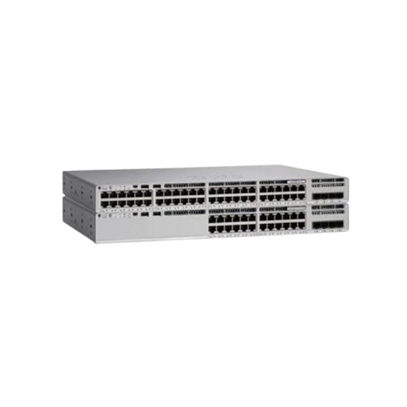
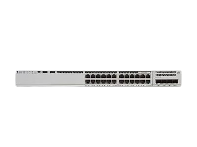

# Switch

**This page presents the switch models used at the headquarters and branch sites. It summarizes the selected hardware and key specifications for each location.**

### Headquarters

The headquarters core switch handles the main campus switching workload.

Cisco Catalyst C9200L-48PXG-4X

<figure><figcaption></figcaption></figure>

#### Specifications

| Specification      | Detail                                                                                                                                        |
| ------------------ | --------------------------------------------------------------------------------------------------------------------------------------------- |
| Switching Capacity | 392 Gbps                                                                                                                                      |
| Forwarding Rate    | 291.66 Mpps                                                                                                                                   |
| Amount             | 2                                                                                                                                             |
| Price              | \~460,000 THB                                                                                                                                 |
| Data Sheet         | [Reference](https://www.cisco.com/c/en/us/products/collateral/switches/catalyst-9200-series-switches/nb-06-cat9200-ser-data-sheet-cte-en.pdf) |

### Branch

The branch core switch provides local switching and PoE capacity.

Cisco Meraki MS225-48FP L2 Stck Cld-Mngd 48x GigE 740W PoE Switch

<figure><figcaption></figcaption></figure>

#### Specifications

| Specification      | Detail                            |
| ------------------ | --------------------------------- |
| Switching Capacity | 176 Gbps                          |
| Forwarding Rate    | 127.98 Mpps                       |
| Amount             | 1                                 |
| Price              | \~148,000 THB                     |
| Data Sheet         | [Reference](https://cmu.to/MNGYE) |

The branch access switch connects user devices and local edge ports.

Cisco Catalyst C9200L-24T-4G

<figure><figcaption></figcaption></figure>

#### Specifications

| Specification      | Detail                            |
| ------------------ | --------------------------------- |
| Switching Capacity | 56 Gbps                           |
| Forwarding Rate    | 41.67 Mpps                        |
| Amount             | 18                                |
| Price              | \~31,000 THB                      |
| Data Sheet         | [Reference](https://cmu.to/NbvKt) |
