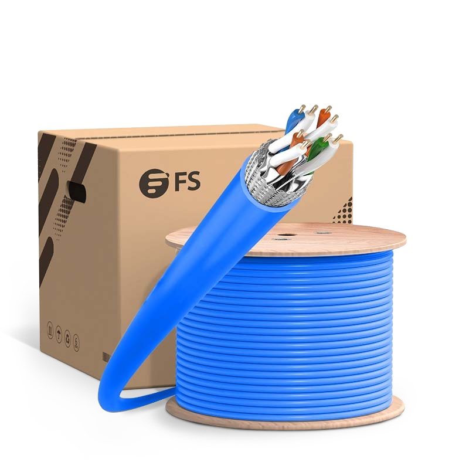
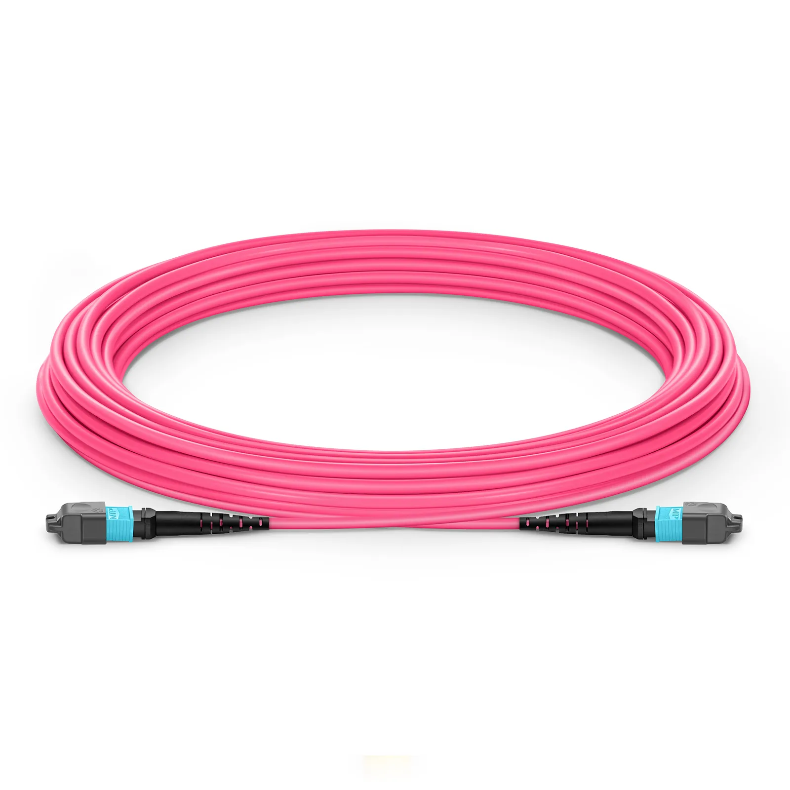

# Wire

**This page presents the cable types used in the network design. It summarizes the selected copper and fiber cabling and their key specifications.**

### Copper Wire

The copper cable is used for standard Ethernet connections to endpoint devices and access infrastructure.

CAT6A

<figure><figcaption></figcaption></figure>

#### Specifications

| Specification | Detail                                                  |
| ------------- | ------------------------------------------------------- |
| Speed         | 10 Gbps                                                 |
| Range         | 100 m                                                   |
| Price         | \~10,933 THB                                            |
| Amount        | 400 m                                                   |
| Reference     | [Reference](https://www.fs.com/sg/products/123982.html) |

### Fiber Wire

The fiber cable is used for high-speed uplinks and backbone connections between network equipment.

1.5m (5ft) MTP® Jumper, MTP®-12 UPC (Female) to MTP®-12 UPC (Female), 12 Fibers, Multimode (OM4), Plenum (OFNP), 0.35dB Max, Type B, Magenta

<figure><figcaption></figcaption></figure>

#### Specifications

| Specification | Detail                                                                            |
| ------------- | --------------------------------------------------------------------------------- |
| Wavelength    | 850/1300 nm                                                                       |
| Fiber Mode    | OM4 50/125µm                                                                      |
| Polish Type   | UPC to UPC                                                                        |
| Price         | \~1,854 THB                                                                       |
| Amount        | 24                                                                                |
| Reference     | [Reference](https://www.fs.com/sg/products/73704.html?attribute=6140\&id=3946830) |
