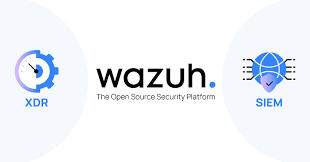

# Network monitoring and SIEM

**This page defines the selected network monitoring and SIEM solutions for the organization.**

The organization uses **PRTG Network Monitor** for network monitoring and **Wazuh** for SIEM and security event monitoring.

These tools provide visibility across the network while keeping the security stack practical for a growing startup.

### Selected network monitoring solution

<figure><figcaption></figcaption></figure>

The organization uses **PRTG Network Monitor** as the primary monitoring platform.

| Tool Name            | Features                                                        | Cost                  |
| -------------------- | --------------------------------------------------------------- | --------------------- |
| PRTG Network Monitor | Network monitoring, bandwidth visibility, alerts, and discovery | Budget: ฿5,000–20,000 |

### Reason for selection

* Easy to deploy and manage
* Provides clear visibility into device health and traffic usage
* Supports alerting for abnormal behavior and service issues
* Helps monitor bandwidth and network availability across both sites

### PRTG in this organization

PRTG is used to monitor network devices, bandwidth usage, and service availability at the headquarters and branch sites.

It helps the team detect outages, performance issues, and unusual traffic patterns early.

### Selected SIEM solution

The organization uses **Wazuh** as its SIEM platform.

Wazuh is a strong fit for a startup because it provides security monitoring without high licensing cost.

<figure><figcaption></figcaption></figure>

| Tool Name | Features                                                 | Cost         |
| --------- | -------------------------------------------------------- | ------------ |
| Wazuh     | Open-source threat detection, monitoring, and compliance | Budget: Free |

### Reason for selecting Wazuh

* Suitable for startup budget constraints
* No high upfront software licensing cost
* Supports centralized monitoring and alerting
* Helps detect threats and track security events
* Scales as the organization grows

### Wazuh usage in this organization

Wazuh is used to collect and monitor security logs from network and system components across the headquarters and branch sites.

It supports visibility, alerting, and incident investigation while keeping operational cost low.
