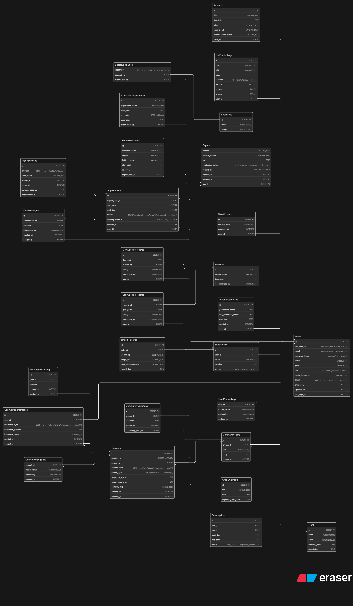

# Database Design

### Overview

ฐานข้อมูลของ MotherNest ถูกออกแบบให้รองรับการใช้งานหลายด้านในแพลตฟอร์มเดียว ทั้งการดูแลแม่และเด็ก การปรึกษาผู้เชี่ยวชาญ ระบบเนื้อหา ชุมชนผู้ใช้งาน และการแนะนำคอนเทนต์ด้วย AI

แนวทางหลักคือใช้ฐานข้อมูลเชิงสัมพันธ์ เพื่อให้ข้อมูลเป็นระเบียบ ลดความซ้ำซ้อน และเชื่อมโยงกันได้ชัดเจนในระดับระบบ


หัวใจของโครงสร้างนี้คือใช้ `Users` เป็นศูนย์กลาง แล้วเชื่อมไปยังโมดูลอื่นตามบริบทการใช้งานจริง เช่น การนัดหมาย การติดตามสุขภาพ วัคซีน คอนเทนต์ และการแจ้งเตือน


### สิ่งที่ระบบฐานข้อมูลต้องรองรับ

* การสมัครสมาชิกและเข้าสู่ระบบ
* การปรึกษาผู้เชี่ยวชาญและวิดีโอคอล
* การติดตามข้อมูลการตั้งครรภ์และพัฒนาการเด็ก
* การบันทึกวัคซีนของแม่และเด็ก
* ระบบคอนเทนต์และ AI Recommendation
* Community สำหรับโพสต์และคอมเมนต์
* Marketplace สำหรับสินค้า
* ระบบสมาชิกและการแจ้งเตือน

### โครงสร้างโมดูลของฐานข้อมูล

เพื่อให้ดูแลง่ายและขยายต่อได้ชัดเจน ฐานข้อมูลจึงถูกแยกเป็นหลายโมดูล

| โมดูล                 | หน้าที่                                      |
| --------------------- | -------------------------------------------- |
| User & Authentication | จัดการบัญชีผู้ใช้ การเข้าสู่ระบบ และสิทธิ์   |
| Expert System         | จัดการข้อมูลผู้เชี่ยวชาญและความเชี่ยวชาญ     |
| Appointment           | จัดการนัดหมาย วิดีโอคอล และแชท               |
| Pregnancy & Baby      | ติดตามข้อมูลการตั้งครรภ์และพัฒนาการเด็ก      |
| Vaccine               | บันทึกวัคซีนและประวัติการรับวัคซีน           |
| Content & AI          | จัดการคอนเทนต์และข้อมูลสำหรับ recommendation |
| Community             | จัดการโพสต์ คอมเมนต์ และปฏิสัมพันธ์          |
| Marketplace           | จัดการสินค้าและข้อมูลผู้ขาย                  |
| Subscription          | จัดการแพ็กเกจสมาชิก                          |
| Notification          | จัดการการแจ้งเตือนของระบบ                    |

### ความสัมพันธ์ของข้อมูลในระดับภาพรวม

<figure><figcaption></figcaption></figure>

ภาพนี้ช่วยให้เห็นว่า `Users` และ `Contents` เป็นสองแกนสำคัญของระบบ ส่วนโมดูลอื่นจะเชื่อมเข้ามาตามบทบาทและกิจกรรมของผู้ใช้งาน

### รายละเอียดแต่ละโมดูล

#### 1. User & Authentication

โมดูลนี้ดูแลข้อมูลพื้นฐานของผู้ใช้ การยืนยันตัวตน และการยอมรับเงื่อนไขของระบบ

**ตารางหลัก**

* `Users` เก็บข้อมูลบัญชีผู้ใช้
* `UserConsent` เก็บประวัติการให้ความยินยอม

ฟิลด์สำคัญ

**Users**

| Field           | Type     | Description                          |
| --------------- | -------- | ------------------------------------ |
| `id`            | BIGINT   | Primary Key                          |
| `line_user_id`  | VARCHAR  | LINE Login ID                        |
| `email`         | VARCHAR  | อีเมลผู้ใช้                          |
| `password_hash` | VARCHAR  | รหัสผ่านที่เข้ารหัสแล้ว              |
| `name`          | VARCHAR  | ชื่อผู้ใช้                           |
| `phone`         | VARCHAR  | เบอร์โทรศัพท์                        |
| `role`          | ENUM     | บทบาท เช่น `user`, `expert`, `admin` |
| `status`        | ENUM     | สถานะบัญชี                           |
| `created_at`    | DATETIME | วันที่สร้างบัญชี                     |

**UserConsent**

| Field          | Description          |
| -------------- | -------------------- |
| `user_id`      | ผู้ใช้ที่ให้ consent |
| `consent_type` | ประเภทของ consent    |
| `accepted_at`  | วันและเวลาที่ยอมรับ  |

#### 2. Expert System

ส่วนนี้ใช้เก็บข้อมูลผู้เชี่ยวชาญ เช่น แพทย์ นักโภชนาการ หรือผู้ให้คำปรึกษาด้านสุขภาพ

**ตารางหลัก**

* `Experts` เก็บโปรไฟล์ผู้เชี่ยวชาญ
* `Specialties` เก็บประเภทความเชี่ยวชาญ
* `ExpertSpecialties` ใช้เชื่อมความสัมพันธ์แบบ many-to-many

ตัวอย่างความเชี่ยวชาญที่ระบบอาจรองรับ

* Pediatrician
* Nutritionist
* Obstetrician

ฟิลด์สำคัญของ Experts

| Field                 | Description      |
| --------------------- | ---------------- |
| `user_id`             | FK ไปยัง `Users` |
| `position`            | ตำแหน่ง          |
| `license_number`      | เลขใบอนุญาต      |
| `verification_status` | สถานะการตรวจสอบ  |

#### 3. Appointment & Video Consultation

โมดูลนี้รองรับการนัดหมาย การพูดคุย และการให้คำปรึกษาแบบออนไลน์

**ตารางหลัก**

* `Appointments` เก็บข้อมูลนัดหมาย
* `VideoSessions` เก็บข้อมูลวิดีโอคอล
* `ChatMessages` เก็บประวัติข้อความระหว่างผู้ใช้กับผู้เชี่ยวชาญ

ระบบวิดีโอคอลสามารถออกแบบให้รองรับ provider หลายเจ้าได้ เช่น `Agora`, `Twilio` หรือ `Jitsi`

ฟิลด์สำคัญของ Appointments

| Field            | Description           |
| ---------------- | --------------------- |
| `user_id`        | ผู้ใช้นัดหมาย         |
| `expert_user_id` | ผู้เชี่ยวชาญที่ถูกจอง |
| `start_time`     | เวลาเริ่ม             |
| `end_time`       | เวลาสิ้นสุด           |
| `status`         | สถานะการนัด           |

#### 4. Pregnancy & Baby Tracking

โมดูลนี้ใช้ติดตามข้อมูลสุขภาพของคุณแม่และเด็กในแต่ละช่วงเวลา

**ตารางหลัก**

* `PregnancyProfiles` เก็บข้อมูลการตั้งครรภ์
* `BabyProfiles` เก็บข้อมูลเด็ก
* `GrowthRecords` เก็บข้อมูลพัฒนาการ

ฟิลด์สำคัญ

**PregnancyProfiles**

| Field                   | Description            |
| ----------------------- | ---------------------- |
| `gestational_period`    | อายุครรภ์              |
| `last_menstrual_period` | ประจำเดือนครั้งสุดท้าย |
| `due_date`              | วันกำหนดคลอด           |

**BabyProfiles**

| Field       | Description |
| ----------- | ----------- |
| `name`      | ชื่อเด็ก    |
| `birthdate` | วันเกิด     |
| `gender`    | เพศ         |

**GrowthRecords**

| Field                | Description |
| -------------------- | ----------- |
| `weight_kg`          | น้ำหนัก     |
| `height_cm`          | ส่วนสูง     |
| `head_circumference` | รอบศีรษะ    |

#### 5. Vaccine

โมดูลนี้ใช้เก็บรายการวัคซีน และประวัติการรับวัคซีนของทั้งแม่และเด็ก

**ตารางหลัก**

* `Vaccines`
* `MomVaccineRecords`
* `BabyVaccineRecords`

ฟิลด์สำคัญของ Vaccines

| Field             | Description  |
| ----------------- | ------------ |
| `vaccine_name`    | ชื่อวัคซีน   |
| `description`     | รายละเอียด   |
| `recommended_age` | อายุที่แนะนำ |

#### 6. Content & AI Recommendation

ส่วนนี้รองรับทั้งคอนเทนต์ในระบบ และข้อมูลที่ใช้สำหรับ recommendation

**ตารางหลัก**

* `Contents`
* `ContentEmbeddings`
* `UserEmbeddings`
* `UserContentInteraction`
* `UserImpressionLog`

ฟิลด์สำคัญของ Contents

| Field              | Description                          |
| ------------------ | ------------------------------------ |
| `content_type`     | เช่น `article`, `video`, `checklist` |
| `source_type`      | เช่น `official`, `community`         |
| `target_stage_min` | อายุครรภ์ขั้นต่ำ                     |
| `target_stage_max` | อายุครรภ์สูงสุด                      |

ตัวอย่าง interaction ที่ควรเก็บเพื่อนำไปใช้ต่อในระบบแนะนำ

* `view`
* `like`
* `share`
* `bookmark`

รายละเอียดฝั่งโมเดลดูต่อได้ที่ [Artificial Intelligence Integration](artificial-intelligence-integration.md)

#### 7. Community

โมดูลชุมชนใช้สำหรับโพสต์ แลกเปลี่ยนประสบการณ์ และตอบโต้กันระหว่างผู้ใช้

**ตารางหลัก**

* `CommunityPosts`
* `CommunityComments`

ในกรณีที่ต้องการขยายระบบต่อ อาจเพิ่มตารางสำหรับ reaction, report หรือ moderation ได้ภายหลัง

#### 8. Marketplace

โมดูลนี้รองรับข้อมูลสินค้าและผู้ขาย

**ตารางหลัก**

* `Products`

ฟิลด์สำคัญของ Products

| Field          | Description  |
| -------------- | ------------ |
| `seller_id`    | ผู้ขาย       |
| `title`        | ชื่อสินค้า   |
| `price`        | ราคา         |
| `external_url` | ลิงก์ร้านค้า |

#### 9. Subscription

ใช้สำหรับจัดการแพ็กเกจสมาชิก และสถานะการใช้งานของแต่ละบัญชี

**ตารางหลัก**

* `Plans`
* `Subscriptions`

ฟิลด์สำคัญของ Subscriptions

| Field        | Description       |
| ------------ | ----------------- |
| `user_id`    | ผู้สมัคร          |
| `plan_id`    | แพ็กเกจที่เลือก   |
| `start_date` | วันที่เริ่มใช้งาน |
| `end_date`   | วันที่หมดอายุ     |

#### 10. Notification

โมดูลนี้ใช้เก็บประวัติการแจ้งเตือนจากระบบ

**ตารางหลัก**

* `NotificationLogs`

ฟิลด์สำคัญของ NotificationLogs

| Field     | Description                  |
| --------- | ---------------------------- |
| `user_id` | ผู้รับ                       |
| `type`    | ประเภทการแจ้งเตือน           |
| `channel` | เช่น `line`, `email`, `push` |
| `is_read` | สถานะการอ่าน                 |

### หลักการออกแบบฐานข้อมูล

การออกแบบของระบบนี้ยึดหลักพื้นฐาน 4 ข้อ

#### Normalization

ลดความซ้ำซ้อนของข้อมูล และช่วยให้ข้อมูลมีความสอดคล้องกันมากขึ้น

#### Scalability

เปิดทางให้ระบบเติบโตต่อได้ เช่น

* เพิ่ม AI model
* เพิ่ม content provider
* เพิ่ม video provider

#### Data Integrity

ใช้ Foreign Key, Constraint และโครงสร้างความสัมพันธ์ที่ชัดเจน เพื่อรักษาความถูกต้องของข้อมูล

#### Performance Optimization

เลือกทำ index ในฟิลด์ที่ถูกใช้งานบ่อย เช่น

* `user_id`
* `content_id`
* `appointment_id`
* `created_at`

### สรุป

ฐานข้อมูลของ MotherNest ถูกออกแบบให้แยกตามหน้าที่ของระบบ แต่ยังเชื่อมถึงกันผ่านข้อมูลผู้ใช้และกิจกรรมสำคัญในแพลตฟอร์มเดียวกัน

แนวทางนี้ช่วยให้ระบบดูแลง่าย ขยายต่อได้ และพร้อมรองรับฟีเจอร์ที่ต้องใช้ข้อมูลหลายส่วนร่วมกัน เช่น การติดตามสุขภาพ การปรึกษาผู้เชี่ยวชาญ และ AI Recommendation
